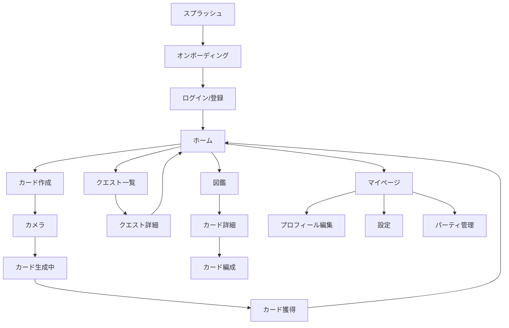

# Real Quest - UI/UXデザイン指針

## 1. デザインコンセプト

### 1.1 デザインビジョン
**「冒険心をくすぐる、家族みんなが楽しめるファンタジー世界」**

### 1.2 デザイン原則

#### 1. わかりやすさ（Clarity）
- 子供から大人まで直感的に操作できる
- アイコンとテキストの併用
- 明確なビジュアルヒエラルキー

#### 2. 楽しさ（Delight）
- カラフルで魅力的なビジュアル
- マイクロアニメーション
- 達成感を感じる演出

#### 3. 安心感（Safety）
- 子供が安心して使える配色とトーン
- 過剰な刺激を避けた穏やかなデザイン
- 保護者にも信頼されるデザイン

#### 4. 一貫性（Consistency）
- 統一されたデザインシステム
- 予測可能なインタラクション
- プラットフォーム標準への準拠

## 2. カラーパレット

### 2.1 プライマリカラー

```
🔵 Primary (冒険の青)
- Main: #4A90E2
- Light: #7AB3F5
- Dark: #2C6BB8
- 用途: CTA、アクティブ状態、強調

🟢 Secondary (自然の緑)
- Main: #52C41A
- Light: #7FD957
- Dark: #3A9E0D
- 用途: 成功、ポジティブアクション

🟡 Accent (宝物の金)
- Main: #FFB800
- Light: #FFD54F
- Dark: #FF9500
- 用途: レアアイテム、特別な要素
```

### 2.2 セマンティックカラー

```
✅ Success (緑)
- #52C41A
- クエスト達成、カード獲得

⚠️ Warning (黄)
- #FAAD14
- 注意喚起、期限間近

❌ Error (赤)
- #F5222D
- エラー、失敗

ℹ️ Info (青)
- #1890FF
- 情報提供、ヒント
```

### 2.3 グレースケール

```
- Gray 900 (Text Primary): #1A1A1A
- Gray 700 (Text Secondary): #595959
- Gray 500 (Text Disabled): #8C8C8C
- Gray 300 (Border): #D9D9D9
- Gray 100 (Background): #F5F5F5
- White: #FFFFFF
```

### 2.4 レア度カラー

```
Common (コモン): #8C8C8C (グレー)
Uncommon (アンコモン): #52C41A (グリーン)
Rare (レア): #1890FF (ブルー)
Epic (エピック): #9254DE (パープル)
Legendary (レジェンダリー): #FF9500 (ゴールド)
```

## 3. タイポグラフィ

### 3.1 フォントファミリー

#### 日本語
```
Primary: Noto Sans JP
- Regular (400): 本文
- Medium (500): 小見出し
- Bold (700): 見出し
- Black (900): タイトル

Fallback: -apple-system, BlinkMacSystemFont, "Segoe UI", "Yu Gothic", sans-serif
```

#### 英数字
```
Primary: Inter
- Regular (400)
- Medium (500)
- Bold (700)
- Black (900)

数値専用: Roboto Mono（統計、パラメータ）
```

### 3.2 タイプスケール

| レベル | サイズ | 行間 | 用途 |
|--------|--------|------|------|
| **H1** | 28px | 36px | ページタイトル |
| **H2** | 24px | 32px | セクション見出し |
| **H3** | 20px | 28px | サブセクション |
| **H4** | 18px | 26px | カード見出し |
| **Body Large** | 16px | 24px | 重要な本文 |
| **Body** | 14px | 22px | 標準本文 |
| **Caption** | 12px | 18px | 補足テキスト |
| **Overline** | 11px | 16px | ラベル、タグ |

## 4. スペーシングシステム

### 4.1 8pxグリッド

```
XXS: 4px   (微調整)
XS:  8px   (要素内の余白)
S:   16px  (関連要素間)
M:   24px  (セクション内)
L:   32px  (セクション間)
XL:  48px  (大きな区切り)
XXL: 64px  (ページ区切り)
```

### 4.2 レイアウトマージン

```
Mobile (< 768px):  16px
Tablet (768-1024px): 24px
Desktop (> 1024px): 32px
```

## 5. コンポーネント設計

### 5.1 ボタン

#### Primary Button
```
背景色: Primary (#4A90E2)
テキスト色: White
高さ: 48px (Mobile), 40px (Desktop)
Border Radius: 24px（完全な丸角）
Padding: 16px horizontal
Shadow: 0 2px 8px rgba(74, 144, 226, 0.3)

Hover: 背景色 → Primary Dark
Active: Scale(0.96)
Disabled: 背景色 → Gray 300, テキスト色 → Gray 500
```

#### Secondary Button
```
背景色: White
テキスト色: Primary
Border: 2px solid Primary
その他はPrimaryと同様

Hover: 背景色 → Primary Light (10% opacity)
```

#### Text Button
```
背景色: Transparent
テキスト色: Primary
Padding: 8px horizontal

Hover: 背景色 → Primary Light (5% opacity)
```

### 5.2 カードコンポーネント

#### カード表示（コレクション）

```
┌─────────────────────┐
│                     │
│    [カード画像]      │  ← 3:4 アスペクト比
│                     │
├─────────────────────┤
│ 🌸 桜の木           │  ← カード名（H4）
│ ★★★★☆ Epic         │  ← レア度（色付き）
├─────────────────────┤
│ ⚔️ 45  🛡️ 60       │  ← パラメータ
│ ⚡ 30  🔧 50       │
└─────────────────────┘

Border Radius: 16px
Background: White
Shadow: 0 4px 12px rgba(0, 0, 0, 0.1)
Padding: 16px
```

**ホバーエフェクト**:
- Transform: translateY(-4px)
- Shadow: 0 8px 24px rgba(0, 0, 0, 0.15)
- Transition: 0.2s ease-out

#### カード詳細モーダル

```
┌─────────────────────────────┐
│ [×]                         │ ← 閉じるボタン
│                             │
│     [大きなカード画像]       │
│                             │
├─────────────────────────────┤
│ 🌸 桜の木                    │
│ カテゴリ: 自然               │
│ レア度: ★★★★☆ Epic         │
├─────────────────────────────┤
│ 【パラメータ】               │
│ ⚔️ 攻撃力:  ▓▓▓▓▓░░░░░ 45  │
│ 🛡️ 防御力:  ▓▓▓▓▓▓░░░░ 60  │
│ ⚡ 速度:    ▓▓▓░░░░░░░ 30  │
│ 🔧 実用性:  ▓▓▓▓▓░░░░░ 50  │
├─────────────────────────────┤
│ 春の訪れを告げる美しい桜...  │ ← 説明文
├─────────────────────────────┤
│ 📅 2025-03-15 取得          │
│ 📍 上野公園                 │
│ 🏷️ #春 #自然 #ピンク        │
└─────────────────────────────┘

Background: White
Max Width: 480px
Border Radius: 24px
Shadow: 0 20px 60px rgba(0, 0, 0, 0.3)
```

### 5.3 クエストカード

```
┌─────────────────────────────┐
│ 🎯 デイリークエスト          │
├─────────────────────────────┤
│ 🌳 自然を探せ                │
│ 植物のカードを3枚作成しよう   │
│                             │
│ 進捗: ▓▓▓░░ 1/3            │
│                             │
│ 報酬: 💰 50コイン ⭐ 100XP  │
│                             │
│ [📸 カードを作る] ← CTAボタン │
└─────────────────────────────┘

Background: Linear Gradient
  (Primary Light → Primary, 135deg)
Text Color: White
Border Radius: 16px
Padding: 20px
Shadow: 0 4px 16px rgba(74, 144, 226, 0.4)
```

### 5.4 プログレスバー

```
┌─────────────────────────────┐
│ Level 12                    │
│ ▓▓▓▓▓▓▓▓▓▓▓▓▓░░░░░░  65%   │
│ 650 / 1000 XP               │
└─────────────────────────────┘

Height: 8px
Border Radius: 4px
Background: Gray 200
Fill: Linear Gradient (Secondary, Accent)
Animation: 0.5s ease-out（レベルアップ時）
```

### 5.5 ステータスバッジ

```
New!      → 背景: #FF4D4F, テキスト: White
Limited   → 背景: #FFB800, テキスト: White
Complete  → 背景: #52C41A, テキスト: White
Locked    → 背景: Gray 300, テキスト: Gray 700

Border Radius: 4px
Padding: 4px 8px
Font Size: 11px
Font Weight: Bold
```

## 6. アイコンシステム

### 6.1 アイコンライブラリ
**採用**: Material Symbols（Google）または Lucide Icons

**サイズ規定**:
- Small: 16px（インラインテキスト内）
- Medium: 24px（標準、ボタン内）
- Large: 32px（見出し横）
- XLarge: 48px（空状態、エラー画面）

### 6.2 主要アイコン

| カテゴリ | アイコン | 用途 |
|----------|----------|------|
| **ナビゲーション** |
| ホーム | 🏠 house | ホーム画面 |
| カメラ | 📸 camera | カード作成 |
| クエスト | 🎯 target | クエスト一覧 |
| 図鑑 | 📚 book | カードコレクション |
| マイページ | 👤 person | プロフィール |
| **カテゴリ** |
| 自然 | 🌳 nature | 自然カード |
| 人工物 | 🏗️ construction | 人工物カード |
| 場所 | 📍 location | 場所カード |
| 生き物 | 🐾 pawprint | 生き物カード |
| **アクション** |
| 追加 | ➕ add | 新規作成 |
| 編集 | ✏️ edit | 編集 |
| 削除 | 🗑️ delete | 削除 |
| 共有 | 🔗 share | シェア |
| 交換 | 🔄 swap | カード交換 |

### 6.3 カスタムアイコン

特定の機能には専用アイコンをデザイン:
- カードフレーム（レア度別）
- パラメータアイコン（攻撃、防御、速度、実用性）
- 特殊スキルアイコン

## 7. アニメーション

### 7.1 マイクロインタラクション

#### カード獲得演出
```
1. フェードイン（0.3s）
2. スケールアップ（0.5s, ease-out）
   0.8 → 1.0
3. 軽いバウンス（0.2s）
   1.0 → 1.05 → 1.0
4. キラキラエフェクト（パーティクル）
```

#### レベルアップ演出
```
1. プログレスバー満タン
2. フラッシュエフェクト（0.2s）
3. 「Level Up!」テキスト表示
4. 紙吹雪アニメーション（1.5s）
5. 新レベル表示（数字カウントアップ）
```

#### ボタンタップフィードバック
```
1. Scale: 1.0 → 0.96 (100ms)
2. Shadow縮小
3. ハプティックフィードバック（デバイス振動）
4. Scale: 0.96 → 1.0 (100ms)
```

### 7.2 画面遷移

#### スライドイン（標準）
```
Duration: 300ms
Easing: cubic-bezier(0.4, 0.0, 0.2, 1)
Direction: Right → Left

新画面:
  - translateX: 100% → 0%
  - opacity: 0.8 → 1.0

旧画面:
  - translateX: 0% → -30%
  - opacity: 1.0 → 0.5
```

#### モーダル
```
Duration: 250ms
Easing: ease-out

モーダル:
  - scale: 0.9 → 1.0
  - opacity: 0 → 1.0

背景:
  - opacity: 0 → 0.5 (黒オーバーレイ)
```

### 7.3 ローディング

#### スケルトンスクリーン
```
┌─────────────────┐
│ ▓▓▓▓▓░░░░░░░░░ │ ← グラデーション波
│ ▓▓▓░░░░░░░░░░░ │    アニメーション
│ ▓▓▓▓░░░░░░░░░░ │    (Shimmer Effect)
└─────────────────┘

Background: Linear Gradient
  (#F0F0F0 → #E0E0E0 → #F0F0F0)
Animation: 1.5s infinite
```

#### スピナー（ロード中）
```
円形スピナー
色: Primary
サイズ: 40px
Stroke Width: 4px
Animation: rotate 1s linear infinite
```

## 8. 画面設計

### 8.1 画面一覧



### 8.2 ホーム画面

```
┌─────────────────────────────┐
│ [≡]  Real Quest    [👤]    │ ← ヘッダー
├─────────────────────────────┤
│                             │
│ おかえり、冒険者さん！        │ ← 挨拶
│                             │
│ ┌─────────────────────────┐ │
│ │ Level 12                │ │
│ │ ▓▓▓▓▓▓▓▓▓░░ 650/1000 XP│ │ ← ステータス
│ │ 💰 1,250 コイン          │ │
│ └─────────────────────────┘ │
│                             │
│ 📅 今日のクエスト             │ ← セクション
│ ┌───────────────┐           │
│ │ 🌳 自然を探せ  │           │
│ │ 進捗: 1/3     │           │ ← クエストカード（横スクロール）
│ └───────────────┘           │
│                             │
│ 🆕 最近のカード               │
│ [カード] [カード] [カード]   │ ← カードグリッド
│                             │
│ 🎯 おすすめアクション          │
│ [📸 カードを作る]            │ ← CTA
│ [🗺️ 近くのクエスト]          │
└─────────────────────────────┘
│ [🏠] [📸] [🎯] [📚] [👤]   │ ← ボトムナビ
└─────────────────────────────┘
```

### 8.3 カード作成フロー

#### Step 1: カメラ画面
```
┌─────────────────────────────┐
│ [×]                         │
│                             │
│                             │
│     [カメラプレビュー]        │
│                             │
│                             │
│         [🎯]                │ ← フォーカスガイド
│                             │
│                             │
│                             │
│       [📸 撮影]              │ ← シャッターボタン
└─────────────────────────────┘
```

#### Step 2: 生成中
```
┌─────────────────────────────┐
│                             │
│     [スピナーアニメーション]   │
│                             │
│   AIがカードを生成中...       │
│   少々お待ちください          │
│                             │
└─────────────────────────────┘
```

#### Step 3: カード獲得
```
┌─────────────────────────────┐
│                             │
│   🎉 新しいカードを獲得！     │
│                             │
│  ┌─────────────────────┐    │
│  │                     │    │
│  │   [カード画像]       │    │ ← キラキラエフェクト
│  │                     │    │
│  │ 🌸 桜の木            │    │
│  │ ★★★★☆ Epic         │    │
│  └─────────────────────┘    │
│                             │
│ [詳細を見る] [デッキに追加]   │
└─────────────────────────────┘
```

### 8.4 図鑑画面

```
┌─────────────────────────────┐
│ ← 図鑑              [🔍]    │ ← 検索
├─────────────────────────────┤
│ [すべて][自然][人工][場所] │ ← フィルタ
├─────────────────────────────┤
│ 達成率: 65% (85/130)        │ ← プログレス
├─────────────────────────────┤
│ ┌───┐ ┌───┐ ┌───┐ ┌───┐   │
│ │🌸 │ │🏯 │ │🦌 │ │❓ │   │
│ │桜 │ │城 │ │鹿 │ │？ │   │ ← カードグリッド
│ └───┘ └───┘ └───┘ └───┘   │    (4列)
│ ┌───┐ ┌───┐ ┌───┐ ┌───┐   │
│ │🌊 │ │⛩️ │ │❓ │ │❓ │   │
│ │海 │ │鳥居│ │？ │ │？ │   │
│ └───┘ └───┘ └───┘ └───┘   │
└─────────────────────────────┘
```

**未獲得カード**:
- Grayscale フィルタ
- 「？」表示
- タップでヒント表示

### 8.5 クエスト一覧

```
┌─────────────────────────────┐
│ ← クエスト                   │
├─────────────────────────────┤
│ [デイリー][ウィークリー][地域]│ ← タブ
├─────────────────────────────┤
│ 📅 2025-03-15のクエスト      │
│                             │
│ ┌─────────────────────────┐ │
│ │ 🌳 自然を探せ            │ │
│ │ 植物のカードを3枚作成    │ │
│ │ 進捗: ▓▓░░ 1/3          │ │
│ │ 報酬: 💰50 ⭐100        │ │
│ └─────────────────────────┘ │
│                             │
│ ┌─────────────────────────┐ │
│ │ 🏃 アクティブに！        │ │
│ │ 5km以上移動しよう        │ │
│ │ 進捗: ▓░░░ 1.2/5.0 km   │ │
│ │ 報酬: 💰30 ⭐80         │ │
│ └─────────────────────────┘ │
│                             │
│ ┌─────────────────────────┐ │
│ │ ✅ バラエティコレクター   │ │
│ │ 達成済み                 │ │
│ │ 報酬受取済み             │ │
│ └─────────────────────────┘ │
└─────────────────────────────┘
```

## 9. レスポンシブデザイン

### 9.1 ブレークポイント

```
Mobile S:  320px - 374px
Mobile M:  375px - 424px
Mobile L:  425px - 767px
Tablet:    768px - 1023px
Desktop:   1024px+
```

### 9.2 レイアウト調整

| 要素 | Mobile | Tablet | Desktop |
|------|--------|--------|---------|
| カードグリッド | 2列 | 3列 | 4～6列 |
| フォントサイズ | 標準 | 標準 | +2px |
| パディング | 16px | 24px | 32px |
| ナビゲーション | ボトム | ボトム | サイド |

## 10. アクセシビリティ

### 10.1 カラーコントラスト

**WCAG 2.1 AAレベル準拠**:
- テキスト（標準）: 4.5:1以上
- テキスト（大サイズ）: 3:1以上
- UIコンポーネント: 3:1以上

### 10.2 タッチターゲット

**最小サイズ**: 44×44 px（iOS）、48×48 px（Android）

**間隔**: 最低8px

### 10.3 フォーカス表示

```
Outline: 2px solid Primary
Offset: 2px
Border Radius: コンポーネントに合わせる
```

### 10.4 スクリーンリーダー対応

- すべての画像に`alt`属性
- ボタンに明確なラベル
- `aria-label`で補足説明
- セマンティックHTML使用

## 11. ダークモード

### 11.1 カラーパレット（ダーク）

```
Background:
- Primary: #121212
- Secondary: #1E1E1E
- Elevated: #2C2C2C

Text:
- Primary: #E0E0E0
- Secondary: #A0A0A0
- Disabled: #606060

Primary Color: #5BA3FF (明度アップ)
Secondary Color: #6DD230 (明度アップ)
```

### 11.2 適用ルール

- システム設定に追従（デフォルト）
- アプリ内で手動切り替え可能
- カード画像は元の明るさを維持
- アイコンは白系に反転

---

**バージョン**: 1.0  
**最終更新**: 2025-11-29  
**作成者**: Antigravity AI
