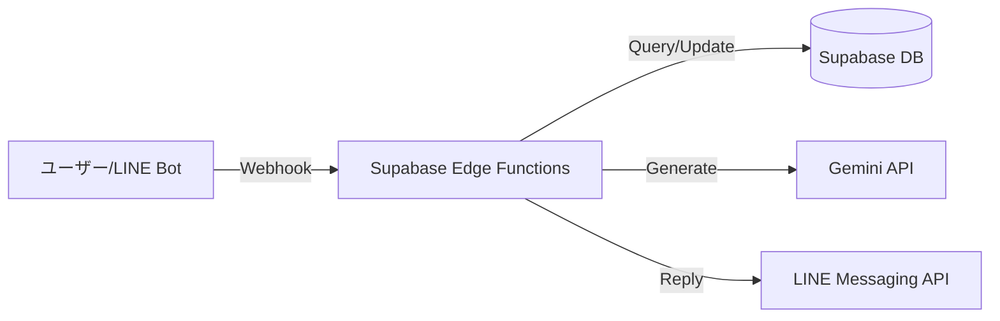

# Real Quest - Supabase Edge Functions 仕様書

n8nを使用せず、Supabase Edge Functions (Deno/TypeScript) を使用してバックエンドロジックを実装します。

## 1. アーキテクチャ概要



## 2. 実装する関数一覧

| 関数名 | エンドポイント | 役割 |
|--------|--------------|------|
| `checkin` | `/functions/v1/checkin` | 施設チェックイン、レシート検証、カード抽選 |
| `battle-action` | `/functions/v1/battle-action` | バトルロジック、ダメージ計算、報酬付与 |
| `line-webhook` | `/functions/v1/line-webhook` | LINE Botからのイベント受信・応答 |
| `admin-generate-card` | `/functions/v1/admin-generate-card` | Gemini APIを使用したカード画像生成（管理者用） |

---

## 3. 関数詳細仕様

### 3.1 `checkin` (チェックイン & カード獲得)

**リクエスト**:
```json
{
  "userId": "UUID",
  "latitude": 37.123,
  "longitude": 139.123,
  "facilityId": "UUID",
  "paymentAmount": 3500,
  "receiptImage": "base64..."
}
```

**ロジック**:
1.  **距離検証**: ユーザー位置と施設位置の距離を計算（PostGIS `ST_Distance`利用）。
2.  **レシート検証**: `paymentAmount` >= 3000 の場合、Gemini API (`gemini-1.5-flash`) に画像を送信し、金額と日付を検証。
3.  **カード枚数計算**: 施設タイプと金額から計算（例: レストラン1000円毎に+1枚）。
4.  **レア度ブースト**: 金額に応じて確率テーブルを調整。
5.  **抽選実行**:
    *   `region_card_limits` をチェックしながらカードを選定。
    *   DBトランザクションを使用して、カード付与と上限カウント更新をアトミックに実行。
6.  **レスポンス**: 獲得したカード情報を返す。

### 3.2 `battle-action` (バトル処理)

**リクエスト**:
```json
{
  "userId": "UUID",
  "battleId": "UUID",
  "action": "attack" | "skill" | "item",
  "targetId": "UUID",
  "cardId": "UUID" (スキル使用時)
}
```

**ロジック**:
1.  **状態取得**: 現在のバトル状態、敵ステータス、ユーザーステータスを取得。
2.  **ダメージ計算**:
    *   `ダメージ = (攻撃力 * スキル倍率 * 乱数) - 敵防御力`
    *   属性相性補正、クリティカル判定。
3.  **敵HP更新**: DB更新。
4.  **勝利判定**:
    *   **勝利時**: 経験値・コイン計算、ドロップアイテム抽選、ユーザーデータ更新。
    *   **継続時**: 敵AIロジック実行（ランダムまたはパターン）、ユーザーへのダメージ計算、ユーザーHP更新。
5.  **レスポンス**: ターン結果（ダメージ量、メッセージ、更新後のステータス）。

### 3.3 `line-webhook` (LINE Bot統合)

**リクエスト**: LINE PlatformからのWebhookイベント

**ロジック**:
1.  **署名検証**: LINEチャネルシークレットで検証。
2.  **イベント分岐**:
    *   **位置情報メッセージ**: `checkin` 関数ロジックの一部を呼び出し、近くの施設を検索して返信。
    *   **画像メッセージ**: レシート画像として一時保存または即時検証。
    *   **テキスト「ステータス」**: ユーザー情報をDBから取得してFlex Messageで返信。
    *   **テキスト「ガチャ」**: （デバッグ用）簡易ガチャ実行。

### 3.4 `admin-generate-card` (画像生成)

**リクエスト**:
```json
{
  "cardTemplateId": "UUID"
}
```

**ロジック**:
1.  **テンプレート取得**: 対象カードの情報を取得。
2.  **プロンプト構築**: 「AI生成プロンプト集」のロジックでプロンプト作成。
3.  **画像生成**: Gemini API (`imagen-3.0-generate-001`) を呼び出し。
4.  **保存**: 生成画像をSupabase Storageにアップロード。
5.  **更新**: `card_templates` の `image_url` を更新。

---

## 4. 開発環境セットアップ

### 必要なツール
- Supabase CLI
- Deno
- Docker (ローカル開発用)

### コマンド例

```bash
# 関数の作成
supabase functions new checkin

# ローカル実行
supabase functions serve

# デプロイ
supabase functions deploy checkin
```

## 5. 環境変数 (.env)

```
SUPABASE_URL=...
SUPABASE_SERVICE_ROLE_KEY=...
GEMINI_API_KEY=...
LINE_CHANNEL_ACCESS_TOKEN=...
LINE_CHANNEL_SECRET=...
```
