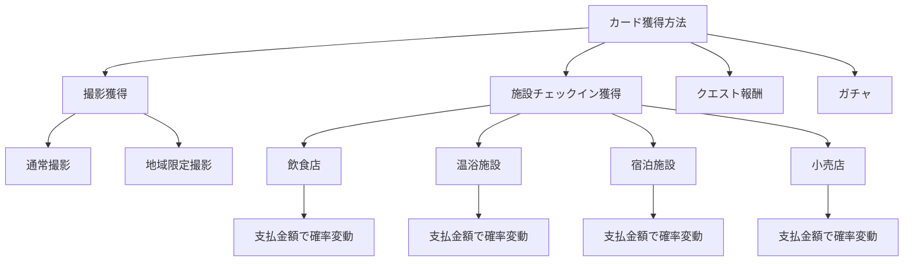

# Real Quest - カード獲得システム詳細仕様

## 1. カード獲得の概要

### 1.1 獲得方法



### 1.2 カード発行の制限

カードには**地域ごとの発行上限**が設定されており、レア度が高いほど発行数が少なくなります。

---

## 2. 地域別カード発行数システム

### 2.1 地域定義

**地域の範囲**: 半径5km圏内を1つの地域として定義

```javascript
// 地域ID生成
function getRegionId(latitude, longitude) {
    // 緯度経度を5kmグリッドに丸める
    const gridSize = 0.045; // 約5km
    const latGrid = Math.floor(latitude / gridSize);
    const lonGrid = Math.floor(longitude / gridSize);
    return `region_${latGrid}_${lonGrid}`;
}
```

### 2.2 レア度別発行上限（地域ごと）

| レア度 | 発行上限/地域 | 再発行間隔 | 説明 |
|--------|--------------|-----------|------|
| **Common** | 無制限 | - | いつでも誰でも入手可能 |
| **Uncommon** | 1,000枚 | 1週間 | やや珍しい |
| **Rare** | 100枚 | 2週間 | 珍しい |
| **Epic** | 10枚 | 1ヶ月 | とても珍しい |
| **Legendary** | 1枚 | 3ヶ月 | その地域で唯一 |

### 2.3 発行状況の可視化

```
┌─────────────────────────────────┐
│ 🌸 桜の木 (Epic)                │
│ 📍 上野公園エリア                │
├─────────────────────────────────┤
│ 残り発行数: 3/10                 │
│ ▓▓▓░░░░░░░ 30%                 │
│                                 │
│ ⚠️ 残りわずか！                 │
│ 次回リセット: 23日後             │
└─────────────────────────────────┘
```

**ユーザーへの表示**:
- 地域マップで発行状況を確認可能
- 残り数が少ないカードは「レア」マーク表示
- 完売した場合は「SOLD OUT」表示

### 2.4 カード発行管理テーブル

```sql
CREATE TABLE region_card_limits (
    id UUID PRIMARY KEY DEFAULT uuid_generate_v4(),
    region_id TEXT NOT NULL,
    card_template_id UUID NOT NULL,
    rarity TEXT NOT NULL,
    max_count INTEGER NOT NULL,
    current_count INTEGER DEFAULT 0,
    reset_at TIMESTAMPTZ,
    created_at TIMESTAMPTZ DEFAULT NOW(),
    UNIQUE(region_id, card_template_id)
);

-- インデックス
CREATE INDEX idx_region_card_limits_region ON region_card_limits(region_id);
CREATE INDEX idx_region_card_limits_rarity ON region_card_limits(rarity);
```

### 2.5 発行チェックロジック

```javascript
async function canIssueCard(regionId, cardTemplateId, rarity) {
    // Common は無制限
    if (rarity === 'common') return true;
    
    // 地域の発行状況を取得
    const limit = await db.from('region_card_limits')
        .select('*')
        .eq('region_id', regionId)
        .eq('card_template_id', cardTemplateId)
        .single();
    
    if (!limit) {
        // 初回発行: レコード作成
        await initializeRegionLimit(regionId, cardTemplateId, rarity);
        return true;
    }
    
    // リセット日時チェック
    if (new Date() > new Date(limit.reset_at)) {
        // リセット処理
        await resetRegionLimit(limit.id);
        return true;
    }
    
    // 発行上限チェック
    return limit.current_count < limit.max_count;
}

// カード発行時にカウント増加
async function issueCard(userId, regionId, cardTemplateId, rarity) {
    if (!await canIssueCard(regionId, cardTemplateId, rarity)) {
        throw new Error('この地域でのカード発行上限に達しています');
    }
    
    // カード作成
    const card = await createCard(userId, cardTemplateId);
    
    // カウント増加（Common以外）
    if (rarity !== 'common') {
        await db.from('region_card_limits')
            .update({ 
                current_count: db.raw('current_count + 1') 
            })
            .eq('region_id', regionId)
            .eq('card_template_id', cardTemplateId);
    }
    
    return card;
}
```

---

## 3. 店舗利用金額による抽選確率システム

### 3.1 基本確率テーブル

| レア度 | 基本確率 | 最低保証 | 最大確率 |
|--------|----------|---------|---------|
| Common | 60% | 60% | 60% |
| Uncommon | 25% | 25% | 35% |
| Rare | 10% | 10% | 25% |
| Epic | 4% | 4% | 15% |
| Legendary | 1% | 1% | 10% |

### 3.2 支払金額による確率補正

#### 補正計算式

```javascript
// 支払金額による確率ブースト計算
function calculateRarityBoost(paymentAmount) {
    const boostTable = [
        { threshold: 0,     boost: 0 },      // 0円: +0%
        { threshold: 500,   boost: 0.05 },   // 500円: +5%
        { threshold: 1000,  boost: 0.10 },   // 1,000円: +10%
        { threshold: 2000,  boost: 0.20 },   // 2,000円: +20%
        { threshold: 3000,  boost: 0.30 },   // 3,000円: +30%
        { threshold: 5000,  boost: 0.50 },   // 5,000円: +50%
        { threshold: 10000, boost: 0.80 },   // 10,000円: +80%
        { threshold: 20000, boost: 1.20 },   // 20,000円: +120%
        { threshold: 50000, boost: 2.00 }    // 50,000円: +200%
    ];
    
    // 該当する最大のboostを取得
    let boost = 0;
    for (const tier of boostTable) {
        if (paymentAmount >= tier.threshold) {
            boost = tier.boost;
        }
    }
    
    return boost;
}

// レア度別の最終確率計算
function calculateFinalProbability(baseProb, boost, maxProb) {
    const boostedProb = baseProb * (1 + boost);
    return Math.min(boostedProb, maxProb);
}
```

#### 具体例: 支払金額別の確率

**1,000円の支払い（+10%ブースト）**:
```
Uncommon: 25% × 1.10 = 27.5%
Rare:     10% × 1.10 = 11%
Epic:      4% × 1.10 = 4.4%
Legendary: 1% × 1.10 = 1.1%
```

**5,000円の支払い（+50%ブースト）**:
```
Uncommon: 25% × 1.50 = 37.5% → 35%（上限）
Rare:     10% × 1.50 = 15%
Epic:      4% × 1.50 = 6%
Legendary: 1% × 1.50 = 1.5%
```

**50,000円の支払い（+200%ブースト）**:
```
Uncommon: 25% × 3.00 = 75% → 35%（上限）
Rare:     10% × 3.00 = 30% → 25%（上限）
Epic:      4% × 3.00 = 12%
Legendary: 1% × 3.00 = 3%
```

### 3.3 施設カテゴリ別のカード枚数

| 施設カテゴリ | 基本カード枚数 | 金額ボーナス | 最大枚数 |
|------------|--------------|------------|---------|
| **コンビニ** | 1枚 | なし | 1枚 |
| **カフェ** | 1枚 | 500円ごと+1枚 | 3枚 |
| **レストラン** | 2枚 | 1,000円ごと+1枚 | 5枚 |
| **温浴施設** | 2枚 | 500円ごと+1枚 | 4枚 |
| **ホテル** | 3枚 | 5,000円ごと+1枚 | 10枚 |
| **小売店** | 1枚 | 1,000円ごと+1枚 | 5枚 |

#### カード枚数計算

```javascript
function calculateCardCount(facilityType, paymentAmount) {
    const settings = {
        convenience: { base: 1, per: 0, max: 1 },
        cafe: { base: 1, per: 500, max: 3 },
        restaurant: { base: 2, per: 1000, max: 5 },
        spa: { base: 2, per: 500, max: 4 },
        hotel: { base: 3, per: 5000, max: 10 },
        retail: { base: 1, per: 1000, max: 5 }
    };
    
    const config = settings[facilityType];
    if (!config) return 1;
    
    let count = config.base;
    
    if (config.per > 0) {
        const bonus = Math.floor(paymentAmount / config.per);
        count += bonus;
    }
    
    return Math.min(count, config.max);
}
```

**具体例**:

```
レストランで3,500円の支払い:
基本: 2枚
ボーナス: floor(3500 / 1000) = 3枚
合計: 2 + 3 = 5枚（上限）

ホテルで25,000円の宿泊:
基本: 3枚
ボーナス: floor(25000 / 5000) = 5枚
合計: 3 + 5 = 8枚
```

---

## 4. 抽選実行システム

### 4.1 抽選フロー

```javascript
async function executeCardDraw(facilityId, userId, paymentAmount) {
    // 1. 施設情報取得
    const facility = await getFacility(facilityId);
    
    // 2. カード枚数計算
    const cardCount = calculateCardCount(facility.type, paymentAmount);
    
    // 3. 確率ブースト計算
    const rarityBoost = calculateRarityBoost(paymentAmount);
    
    // 4. 各カードを抽選
    const drawnCards = [];
    for (let i = 0; i < cardCount; i++) {
        const card = await drawSingleCard(
            userId, 
            facility.region_id, 
            rarityBoost
        );
        drawnCards.push(card);
    }
    
    // 5. 結果表示
    return {
        totalCards: cardCount,
        cards: drawnCards,
        rarityBoost: rarityBoost * 100 + '%'
    };
}

async function drawSingleCard(userId, regionId, rarityBoost) {
    // レア度抽選
    const rarity = drawRarity(rarityBoost);
    
    // 該当レア度のカードテンプレートを取得
    const templates = await getAvailableCardTemplates(regionId, rarity);
    
    if (templates.length === 0) {
        // 在庫切れの場合、1ランク下げる
        return drawSingleCard(userId, regionId, rarityBoost, 
            getLowerRarity(rarity));
    }
    
    // ランダムにテンプレート選択
    const template = templates[Math.floor(Math.random() * templates.length)];
    
    // カード発行
    return await issueCard(userId, regionId, template.id, rarity);
}

function drawRarity(boost) {
    // 確率計算
    const probabilities = {
        legendary: calculateFinalProbability(0.01, boost, 0.10),
        epic: calculateFinalProbability(0.04, boost, 0.15),
        rare: calculateFinalProbability(0.10, boost, 0.25),
        uncommon: calculateFinalProbability(0.25, boost, 0.35),
        common: 0.60 // 固定
    };
    
    // 累積確率で抽選
    const rand = Math.random();
    let cumulative = 0;
    
    for (const [rarity, prob] of Object.entries(probabilities)) {
        cumulative += prob;
        if (rand < cumulative) {
            return rarity;
        }
    }
    
    return 'common'; // fallback
}
```

### 4.2 抽選結果演出

```
┌─────────────────────────────────┐
│                                 │
│      💰 3,500円のお支払い       │
│                                 │
│   🎁 カードを5枚獲得！          │
│   ✨ レア度UP確率 +35%          │
│                                 │
├─────────────────────────────────┤
│                                 │
│   [カードめくり演出]             │
│                                 │
│   1枚目... [めくる]             │
└─────────────────────────────────┘

↓ めくり後

┌─────────────────────────────────┐
│   🌸 桜の木                     │
│   ★★★★☆ Epic                 │
│                                 │
│   おめでとうございます！         │
│   激レアカードです！             │
└─────────────────────────────────┘
```

---

## 5. 天井システム（確定保証）

### 5.1 天井カウント

連続で高レアが出ない場合の救済システム

```javascript
CREATE TABLE user_pity_counter (
    user_id UUID PRIMARY KEY REFERENCES users(id),
    consecutive_no_rare INTEGER DEFAULT 0,
    consecutive_no_epic INTEGER DEFAULT 0,
    consecutive_no_legendary INTEGER DEFAULT 0,
    last_rare_at TIMESTAMPTZ,
    last_epic_at TIMESTAMPTZ,
    last_legendary_at TIMESTAMPTZ
);
```

### 5.2 天井発動条件

| レア度 | 天井回数 | 効果 |
|--------|---------|------|
| Rare以上 | 20回 | 次回Rare以上確定 |
| Epic以上 | 50回 | 次回Epic以上確定 |
| Legendary | 200回 | 次回Legendary確定 |

### 5.3 天井ロジック

```javascript
async function checkPitySystem(userId) {
    const counter = await db.from('user_pity_counter')
        .select('*')
        .eq('user_id', userId)
        .single();
    
    const guarantees = [];
    
    if (counter.consecutive_no_rare >= 20) {
        guarantees.push({ minRarity: 'rare' });
    }
    
    if (counter.consecutive_no_epic >= 50) {
        guarantees.push({ minRarity: 'epic' });
    }
    
    if (counter.consecutive_no_legendary >= 200) {
        guarantees.push({ minRarity: 'legendary' });
    }
    
    return guarantees;
}

// 抽選時に天井チェック
async function drawWithPity(userId, regionId, rarityBoost) {
    const guarantees = await checkPitySystem(userId);
    
    let rarity = drawRarity(rarityBoost);
    
    // 天井保証適用
    for (const guarantee of guarantees) {
        if (getRarityValue(rarity) < getRarityValue(guarantee.minRarity)) {
            rarity = guarantee.minRarity;
        }
    }
    
    // カード発行
    const card = await issueCard(userId, regionId, templateId, rarity);
    
    // 天井カウンター更新
    await updatePityCounter(userId, rarity);
    
    return card;
}
```

---

## 6. 不正対策

### 6.1 レシート認証

高額支払いには証明が必要

```javascript
const RECEIPT_REQUIRED_AMOUNT = 3000; // 3,000円以上

async function checkInWithPayment(facilityId, userId, paymentAmount, receiptImage) {
    if (paymentAmount >= RECEIPT_REQUIRED_AMOUNT && !receiptImage) {
        throw new Error('3,000円以上のお支払いにはレシートの撮影が必要です');
    }
    
    if (receiptImage) {
        // Gemini APIでレシート検証
        const verification = await verifyReceipt(receiptImage, paymentAmount);
        
        if (!verification.valid) {
            throw new Error('レシートの検証に失敗しました');
        }
    }
    
    // カード抽選実行
    return await executeCardDraw(facilityId, userId, paymentAmount);
}
```

### 6.2 不正検知

```javascript
// 1日の上限チェック
const DAILY_MAX_DRAWS = 50;

// 位置情報の整合性チェック
async function validateLocation(userId, facilityId, userLocation) {
    const facility = await getFacility(facilityId);
    const distance = calculateDistance(userLocation, facility.location);
    
    if (distance > 100) { // 100m以上離れている
        throw new Error('施設の近くにいる必要があります');
    }
}
```

---

## 7. ユーザー体験設計

### 7.1 事前確率表示

```
┌─────────────────────────────────┐
│ 🍽️ レストラン太郎               │
│ 📍 渋谷駅前                     │
├─────────────────────────────────┤
│ お支払い金額を入力               │
│ ┌─────────────────────┐        │
│ │ ¥ 3,500            │        │
│ └─────────────────────┘        │
├─────────────────────────────────┤
│ 予想される獲得内容               │
│                                 │
│ 🎁 獲得カード数: 5枚            │
│ ✨ レア度UP: +35%               │
│                                 │
│ 確率:                           │
│ ★★★★★ Legendary  1.4%        │
│ ★★★★☆ Epic       5.4%        │
│ ★★★☆☆ Rare      13.5%        │
│ ★★☆☆☆ Uncommon  27.5%        │
│ ★☆☆☆☆ Common    60%          │
│                                 │
│ ⚠️ この地域のEpic桜の木は     │
│    残り3枚です！                │
│                                 │
│ [チェックイン実行]               │
└─────────────────────────────────┘
```

### 7.2 抽選演出

1. **支払い金額入力**
2. **確率表示**
3. **チェックイン実行**
4. **ローディング**（ワクワク演出）
5. **カードめくり**（1枚ずつ）
6. **レア演出**（Epic以上は特別エフェクト）
7. **結果サマリー**

---

## 8. 統計とバランス調整

### 8.1 想定される平均獲得レア度

| 支払金額 | 平均レア度 | Epic以上確率 |
|---------|-----------|-------------|
| 500円 | Uncommon | 5.0% |
| 1,000円 | Uncommon | 5.5% |
| 3,000円 | Uncommon～Rare | 6.8% |
| 5,000円 | Rare | 9.0% |
| 10,000円 | Rare | 11.5% |
| 20,000円 | Rare～Epic | 15.0% |

### 8.2 地域別カード多様性

1つの地域（5km圏内）で獲得可能なカード種類:
- Common: 100～200種類
- Uncommon: 50～100種類
- Rare: 20～50種類
- Epic: 5～15種類
- Legendary: 1～3種類

---

**バージョン**: 2.0  
**最終更新**: 2025-11-29  
**重要度**: ★★★★★（コアシステム）
