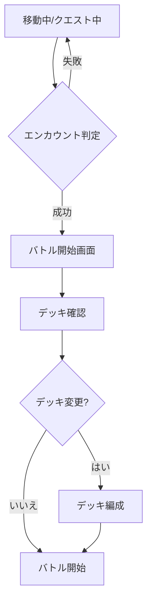
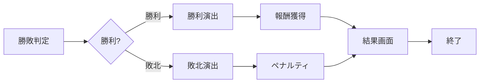

# Real Quest - バトルシステム詳細仕様

## 1. バトルの概要

### 1.1 バトルの種類

#### 🌍 フィールドバトル
- **発生**: 移動中にランダムエンカウント
- **敵**: 野生の敵（難易度: 低～中）
- **報酬**: 少量のXP、コイン、低レアアイテム

#### 🏯 ボスバトル
- **発生**: クエストの最終目標
- **敵**: 強力なボス（難易度: 高）
- **報酬**: 大量のXP、コイン、レアアイテム、特別カード

#### ⚔️ PvPバトル（対人戦）
- **発生**: プレイヤー同士の挑戦
- **敵**: 他のプレイヤーのデッキ（AI操作）
- **報酬**: ランキングポイント、PvP専用アイテム

#### 🎪 イベントバトル
- **発生**: 期間限定イベント
- **敵**: イベント専用の敵
- **報酬**: 限定アイテム、限定カード、イベントポイント

#### 🏛️ タワーバトル
- **発生**: 無限タワーチャレンジ
- **敵**: 階層ごとに強化される敵
- **報酬**: 階層報酬、累計報酬

---

## 2. バトルフロー

### 2.1 バトル開始



### 2.2 バトル進行（ターン制）

```
┌─────────────────────────────────┐
│  ターン開始                      │
│  ↓                              │
│  【プレイヤーフェーズ】          │
│  1. カード選択（最大3枚同時）    │
│  2. アイテム使用（任意）         │
│  3. スキル発動（任意）           │
│  4. 攻撃実行                     │
│  ↓                              │
│  【敵フェーズ】                  │
│  1. AI行動決定                   │
│  2. 攻撃実行                     │
│  ↓                              │
│  【ターン終了処理】              │
│  - バフ/デバフ持続時間減少       │
│  - HP/MP自動回復                 │
│  - 状態異常判定                  │
│  ↓                              │
│  勝敗判定                        │
│  ↓                              │
│  次のターンへ or バトル終了      │
└─────────────────────────────────┘
```

### 2.3 バトル終了



---

## 3. ダメージ計算システム

### 3.1 基本ダメージ計算式

```javascript
// 基本攻撃力
const baseAttack = card.attributes.attack * (1 + playerLevel * 0.02);

// 属性相性補正
const elementalBonus = getElementalBonus(attackerElement, defenderElement);

// バフ/デバフ補正
const buffMultiplier = getTotalBuffMultiplier(activeBuffs);

// 装備補正
const equipmentBonus = getEquipmentBonus(equipment);

// 乱数（90%～110%）
const randomFactor = 0.9 + Math.random() * 0.2;

// 最終攻撃力
const finalAttack = baseAttack * elementalBonus * buffMultiplier * equipmentBonus * randomFactor;

// ダメージ計算
const defense = enemy.defense * (1 + enemy.level * 0.015);
const damage = Math.max(finalAttack - defense, 1);
```

### 3.2 属性相性

```
自然 (Nature)
  ↓ 強い (×1.5)
人工物 (Artifact)
  ↓ 強い (×1.5)
場所 (Location)
  ↓ 強い (×1.5)
生き物 (Creature)
  ↓ 強い (×1.5)
自然 (Nature) ← 戻る

その他 (Other): 相性なし (×1.0)
```

**相性表**:

| 攻撃側 ＼ 防御側 | 自然 | 人工物 | 場所 | 生き物 | その他 |
|-----------------|------|--------|------|--------|--------|
| **自然** | 1.0 | 1.5 | 0.75 | 0.75 | 1.0 |
| **人工物** | 0.75 | 1.0 | 1.5 | 0.75 | 1.0 |
| **場所** | 0.75 | 0.75 | 1.0 | 1.5 | 1.0 |
| **生き物** | 1.5 | 0.75 | 0.75 | 1.0 | 1.0 |
| **その他** | 1.0 | 1.0 | 1.0 | 1.0 | 1.0 |

### 3.3 クリティカルヒット

**発生条件**:
```javascript
const baseCriticalRate = 0.05; // 基本5%
const criticalRate = baseCriticalRate 
    + (card.attributes.speed / 1000) // 速度依存
    + equipmentCriticalBonus // 装備ボーナス
    + buffCriticalBonus; // バフボーナス

if (Math.random() < criticalRate) {
    damage *= 2.0; // クリティカル時2倍
    isCritical = true;
}
```

**クリティカルダメージ**:
- 通常: ダメージ × 2.0
- 装備「炎の指輪」装備時: ダメージ × 2.5
- バフ「高揚」有効時: ダメージ × 2.3

### 3.4 回避

**発生条件**:
```javascript
const baseEvasionRate = 0.03; // 基本3%
const evasionRate = baseEvasionRate 
    + (defender.speed / 1500) // 速度依存
    + equipmentEvasionBonus // 装備ボーナス
    + buffEvasionBonus; // バフボーナス

if (Math.random() < evasionRate) {
    damage = 0;
    isEvaded = true;
}
```

---

## 4. カードスキルシステム

### 4.1 スキルの種類

#### 攻撃スキル

##### ⚡ 連続攻撃 (Rapid Strike)
- **コスト**: MP 20
- **効果**: 2～3回連続攻撃（各50%ダメージ）
- **発動条件**: カードの攻撃力が60以上
- **クールダウン**: 3ターン

##### 🔥 火炎放射 (Flamethrower)
- **コスト**: MP 30
- **効果**: 敵全体に攻撃力80%のダメージ、火傷付与（3ターン、毎ターン10ダメージ）
- **発動条件**: カテゴリが「人工物」
- **クールダウン**: 5ターン

##### ⚔️ 必殺の一撃 (Finishing Blow)
- **コスト**: MP 50
- **効果**: 攻撃力300%の単体攻撃、クリティカル確定
- **発動条件**: HP50%以下
- **クールダウン**: 7ターン

##### 💥 大爆発 (Explosion)
- **コスト**: MP 60、自身のHP30%
- **効果**: 敵全体に攻撃力200%のダメージ
- **発動条件**: レア度Epic以上
- **クールダウン**: 10ターン

#### 防御スキル

##### 🛡️ 鉄壁 (Iron Wall)
- **コスト**: MP 15
- **効果**: 2ターン防御力+50%
- **発動条件**: カードの防御力が60以上
- **クールダウン**: 4ターン

##### 💨 風の守り (Wind Barrier)
- **コスト**: MP 25
- **効果**: 次の敵の攻撃を完全回避
- **発動条件**: カテゴリが「自然」
- **クールダウン**: 6ターン

##### 🌟 聖なる盾 (Holy Shield)
- **コスト**: MP 40
- **効果**: 3ターン、受けるダメージを半減
- **発動条件**: レア度Rare以上
- **クールダウン**: 8ターン

#### 補助スキル

##### 💚 癒しの光 (Healing Light)
- **コスト**: MP 20
- **効果**: HP 100回復
- **発動条件**: カードの実用性が60以上
- **クールダウン**: 5ターン

##### ⚡ 加速 (Acceleration)
- **コスト**: MP 15
- **効果**: 2ターン、攻撃速度+30%（2回攻撃可能）
- **発動条件**: カードの速度が70以上
- **クールダウン**: 5ターン

##### 🎯 集中 (Focus)
- **コスト**: MP 10
- **効果**: 次の攻撃のクリティカル率+50%
- **発動条件**: なし
- **クールダウン**: 3ターン

##### 🔮 魔力増幅 (Magic Amplify)
- **コスト**: MP 30
- **効果**: 3ターン、MP回復速度+100%
- **発動条件**: MP最大値100以上
- **クールダウン**: 7ターン

#### デバフスキル

##### 😵 混乱 (Confusion)
- **コスト**: MP 25
- **効果**: 敵に混乱付与（2ターン、30%の確率で自分を攻撃）
- **発動条件**: なし
- **クールダウン**: 6ターン

##### 🐌 鈍化 (Slowdown)
- **コスト**: MP 20
- **効果**: 敵の速度-40%（3ターン）
- **発動条件**: なし
- **クールダウン**: 5ターン

##### 💔 弱体化 (Weaken)
- **コスト**: MP 30
- **効果**: 敵の攻撃力・防御力-30%（4ターン）
- **発動条件**: レア度Uncommon以上
- **クールダウン**: 8ターン

### 4.2 スキル発動システム

```javascript
// スキル使用可能判定
function canUseSkill(card, skill, currentMP) {
    // MPチェック
    if (currentMP < skill.cost) return false;
    
    // クールダウンチェック
    if (skill.remainingCooldown > 0) return false;
    
    // 発動条件チェック
    if (!checkSkillCondition(card, skill)) return false;
    
    return true;
}

// スキル実行
function executeSkill(skill, user, target) {
    // MPを消費
    user.mp -= skill.cost;
    
    // 効果適用
    applySkillEffect(skill, user, target);
    
    // クールダウン設定
    skill.remainingCooldown = skill.cooldown;
    
    // 演出
    showSkillAnimation(skill);
}
```

---

## 5. 敵システム

### 5.1 敵の種類とレベル

#### 🐺 野生の敵（フィールド）

##### スライム (Slime)
- **レベル**: 1～10
- **HP**: 50～150
- **攻撃**: 10～30
- **防御**: 5～15
- **属性**: その他
- **スキル**: なし
- **ドロップ**: 小ポーション(30%), コイン10-30

##### コボルト (Kobold)
- **レベル**: 5～15
- **HP**: 100～300
- **攻撃**: 20～60
- **防御**: 15～45
- **属性**: 生き物
- **スキル**: 連続攻撃
- **ドロップ**: ポーション(20%), 武器カード(5%)

##### ゴブリン (Goblin)
- **レベル**: 10～20
- **HP**: 200～500
- **攻撃**: 40～100
- **防御**: 30～75
- **属性**: 生き物
- **スキル**: 鈍化
- **ドロップ**: 大ポーション(15%), 装備(10%)

##### オーク (Orc)
- **レベル**: 15～30
- **HP**: 400～1000
- **攻撃**: 80～200
- **防御**: 60～150
- **属性**: 生き物
- **スキル**: 必殺の一撃
- **ドロップ**: レアアイテム(8%), 高級装備(5%)

#### 🏯 ボス敵

##### 森の守護者 (Forest Guardian)
- **レベル**: 25
- **HP**: 3000
- **攻撃**: 150
- **防御**: 120
- **属性**: 自然
- **スキル**: 癒しの光、風の守り、木の根攻撃
- **特殊**: HP50%以下で怒り状態（攻撃力+50%）
- **ドロップ**: Epic装備確定、森の宝珠

##### 機械巨人 (Mechanical Titan)
- **レベル**: 40
- **HP**: 8000
- **攻撃**: 300
- **防御**: 250
- **属性**: 人工物
- **スキル**: 火炎放射、鉄壁、大爆発
- **特殊**: HP30%以下で暴走モード（全ステータス+30%）
- **ドロップ**: Legendary装備(30%), 機械の心臓

##### 古代龍 (Ancient Dragon)
- **レベル**: 60
- **HP**: 20000
- **攻撃**: 500
- **防御**: 400
- **属性**: 生き物
- **スキル**: 全スキル使用可能
- **特殊**: 3形態変化、属性変更
- **ドロップ**: Legendary装備確定、龍の鱗、龍の心臓

##### 闇の支配者 (Dark Overlord)
- **レベル**: 100
- **HP**: 50000
- **攻撃**: 1000
- **防御**: 800
- **属性**: その他
- **スキル**: 全スキル、専用スキル「絶望の波動」
- **特殊**: 全状態異常無効、毎ターンHP5%回復
- **ドロップ**: 最強装備、特別称号

#### 🎪 イベント敵

##### サンタゴーレム (Santa Golem)
- **期間**: 12月限定
- **レベル**: 30
- **HP**: 5000
- **特殊**: プレゼントボックスドロップ
- **ドロップ**: クリスマス限定アイテム、大量コイン

##### 夏の妖精 (Summer Fairy)
- **期間**: 7-8月限定
- **レベル**: 20
- **HP**: 2000
- **特殊**: 倒すとバフ「清涼」付与
- **ドロップ**: 夏限定カード、アイス系アイテム

### 5.2 敵のAI行動パターン

#### パターン1: 猪突猛進型（スライム、コボルト）
```javascript
function selectAction() {
    if (hp < maxHp * 0.3) {
        // HP30%以下: 逃走試行20%
        if (Math.random() < 0.2) return 'escape';
    }
    // 常に攻撃
    return 'attack';
}
```

#### パターン2: バランス型（ゴブリン、オーク）
```javascript
function selectAction() {
    if (hp < maxHp * 0.5) {
        // HP50%以下: ポーション使用または防御
        if (hasPotion && Math.random() < 0.6) return 'usePotion';
        if (Math.random() < 0.4) return 'defend';
    }
    
    if (canUseSkill('鈍化') && Math.random() < 0.3) {
        return 'skill:鈍化';
    }
    
    return 'attack';
}
```

#### パターン3: 戦術型（ボス）
```javascript
function selectAction() {
    // フェーズに応じた戦略
    if (hp > maxHp * 0.7) {
        // フェーズ1: バフをかける
        if (!hasBuff('鉄壁')) return 'skill:鉄壁';
    } else if (hp > maxHp * 0.3) {
        // フェーズ2: 攻撃と防御のバランス
        if (Math.random() < 0.6) return 'skill:必殺の一撃';
        return 'defend';
    } else {
        // フェーズ3: 全力攻撃
        if (canUseSkill('大爆発')) return 'skill:大爆発';
        return 'attack';
    }
    
    return 'attack';
}
```

---

## 6. 報酬システム

### 6.1 基本報酬計算

```javascript
// 経験値
const baseXP = enemy.level * 10;
const xpBonus = 1 + (partySize * 0.1); // パーティボーナス
const xpBuffBonus = hasXPBuff ? 1.5 : 1.0;
const totalXP = Math.floor(baseXP * xpBonus * xpBuffBonus);

// コイン
const baseCoins = enemy.level * 5;
const coinBonus = 1 + (equipmentCoinBonus);
const coinBuffBonus = hasCoinBuff ? 1.5 : 1.0;
const totalCoins = Math.floor(baseCoins * coinBonus * coinBuffBonus);
```

### 6.2 アイテムドロップ

```javascript
function determineDrops(enemy) {
    const drops = [];
    
    // 必須ドロップ（コイン、XP）
    drops.push({ type: 'xp', amount: calculateXP(enemy) });
    drops.push({ type: 'coins', amount: calculateCoins(enemy) });
    
    // ランダムドロップ
    const dropTable = enemy.dropTable;
    for (const item of dropTable) {
        const dropRate = item.rate * (1 + playerLuckBonus);
        if (Math.random() < dropRate) {
            drops.push(item);
        }
    }
    
    // レアドロップ（低確率）
    if (Math.random() < 0.05 + playerLuckBonus) {
        drops.push(getRareItem(enemy.level));
    }
    
    return drops;
}
```

### 6.3 初回撃破ボーナス

```javascript
if (isFirstDefeat(enemy.id)) {
    // 初回ボーナス
    rewards.xp *= 2;
    rewards.coins *= 2;
    
    // 称号獲得
    if (enemy.isBoss) {
        unlockTitle(`${enemy.name}を倒した者`);
    }
    
    // 図鑑登録
    registerToBestiary(enemy);
}
```

### 6.4 連勝ボーナス

```javascript
// 連勝数に応じてボーナス
const winStreak = getWinStreak();
const streakBonus = Math.min(winStreak * 0.05, 0.5); // 最大+50%

rewards.xp *= (1 + streakBonus);
rewards.coins *= (1 + streakBonus);

if (winStreak >= 10) {
    showAchievement('連勝記録10達成！');
    giveBonus({ type: 'gacha_ticket', amount: 1 });
}
```

---

## 7. バトルUI設計

### 7.1 バトル画面レイアウト

```
┌─────────────────────────────────┐
│ ターン 3    残り時間 00:45       │ ← ヘッダー
├─────────────────────────────────┤
│                                 │
│     [敵キャラクター画像]         │
│     敵の名前                     │
│     HP: ▓▓▓▓▓▓░░░░ 600/1000   │
│     🔥火傷 💪攻撃UP              │ ← バフ/デバフ表示
│                                 │
├─────────────────────────────────┤
│                                 │
│  [カード1] [カード2] [カード3]  │ ← 選択カード
│   選択中    選択中     -        │
│                                 │
├─────────────────────────────────┤
│ プレイヤー: 山田 太郎  Lv.12    │
│ HP: ▓▓▓▓▓▓▓▓░░ 450/500        │
│ MP: ▓▓▓▓▓░░░░░ 60/100         │
│ 💚癒し ⚡元気                   │ ← バフ表示
├─────────────────────────────────┤
│ [デッキ一覧]                    │ ← スワイプで表示
│ 🌸桜 🏯城 🦌鹿 🌊海 ⛩️鳥居      │
├─────────────────────────────────┤
│ [⚔️攻撃] [🛡️防御] [💊道具]     │ ← アクションボタン
│           [🔄デッキ変更]         │
└─────────────────────────────────┘
```

### 7.2 ダメージ表示

```
敵に攻撃！
┌──────────┐
│  -456    │ ← 大きく表示
│ CRITICAL!│ ← クリティカル時
└──────────┘

カウンター攻撃を受けた！
┌──────────┐
│  -123    │ ← 赤色で表示
└──────────┘

回復！
┌──────────┐
│  +200    │ ← 緑色で表示
│  💚      │
└──────────┘
```

### 7.3 勝利画面

```
┌─────────────────────────────────┐
│                                 │
│        🎉 VICTORY! 🎉           │
│                                 │
│   ┌─────────────────────┐      │
│   │  経験値: +250       │      │
│   │  コイン: +150       │      │
│   │                     │      │
│   │  ドロップアイテム:   │      │
│   │  🧪 ポーション ×2   │      │
│   │  ⚔️ 鋼の剣         │      │
│   │  🌟 レアカード      │      │
│   └─────────────────────┘      │
│                                 │
│       [次へ]  [デッキ確認]      │
│                                 │
└─────────────────────────────────┘
```

---

## 8. 特殊バトルモード

### 8.1 タイムアタックモード

- **制限時間**: 60秒
- **ルール**: 時間内に倒せなければ敗北
- **報酬**: 残り時間に応じてボーナス
- **高速クリア**: 30秒以内で特別報酬

### 8.2 サバイバルモード

- **ルール**: 連続で敵と戦う、HP回復なし
- **報酬**: 撃破数に応じて増加
- **記録**: ハイスコアランキング

### 8.3 レイドバトル

- **参加**: 最大10人で協力
- **敵**: 超高HPのレイドボス
- **報酬**: 与ダメージに応じた貢献度報酬
- **制限時間**: 10分

---

## 9. バランス調整値

### 9.1 レベル別推奨ステータス

| プレイヤーLv | 推奨HP | 推奨攻撃 | 推奨防御 | 推奨MP |
|-------------|--------|----------|----------|--------|
| 1-10 | 100-300 | 20-60 | 15-45 | 50-80 |
| 11-20 | 300-600 | 60-120 | 45-90 | 80-120 |
| 21-30 | 600-1000 | 120-200 | 90-150 | 120-160 |
| 31-40 | 1000-1500 | 200-300 | 150-225 | 160-200 |
| 41-50 | 1500-2500 | 300-450 | 225-350 | 200-250 |
| 51-60 | 2500-4000 | 450-650 | 350-500 | 250-300 |
| 61-70 | 4000-6000 | 650-900 | 500-700 | 300-350 |
| 71-80 | 6000-8500 | 900-1200 | 700-950 | 350-400 |
| 81-90 | 8500-12000 | 1200-1600 | 950-1300 | 400-450 |
| 91-100 | 12000-20000 | 1600-2500 | 1300-2000 | 450-500 |

### 9.2 バトル時間の目安

- **通常バトル**: 1～3分
- **ボスバトル**: 3～10分
- **レイドバトル**: 5～10分
- **PvP**: 2～5分

---

**バージョン**: 2.0  
**最終更新**: 2025-11-29  
**総敵種類**: 15種類以上  
**総スキル数**: 15種類
