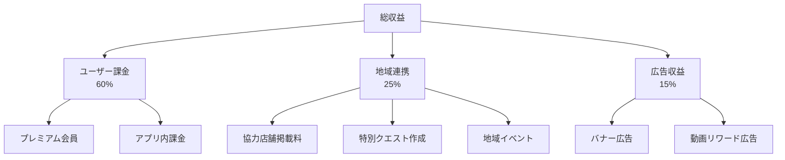
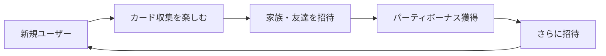

# Real Quest - ビジネスモデル

## 1. ビジネスコンセプト

### 1.1 ミッション
「日常を冒険に変え、家族の絆と地域のつながりを深める」

### 1.2 ビジョン
- 家族のコミュニケーションを促進するプラットフォーム
- 地域経済活性化のエコシステム
- AIを活用した次世代エンターテインメント

### 1.3 バリュープロポジション

#### ユーザーへの価値
- **家族**：楽しみながら子供との時間を過ごせる
- **子供**：現実世界が学びと冒険の場になる
- **地域住民**：地元の魅力を再発見できる

#### ビジネスパートナーへの価値
- **地域店舗**：新規顧客の獲得、集客力向上
- **自治体**：観光促進、地域活性化
- **広告主**：ファミリー層へのリーチ

## 2. 収益モデル

### 2.1 収益の柱（3本柱）

### 2.2 ユーザー課金（60%）

#### 2.2.1 プレミアムサブスクリプション

| プラン | 価格 | 特典 |
|--------|------|------|
| **ベーシック** | 無料 | ・1日10回カード生成 ・広告表示あり ・基本機能のみ |
| **プレミアム** | 月額980円 | ・カード生成無制限 ・広告非表示 ・限定カードフレーム ・ストレージ2倍 |
| **ファミリー** | 月額1,680円 | ・最大5人まで ・プレミアム特典すべて ・家族専用クエスト ・パーティボーナス+50% |

**目標数値（リリース1年後）**:
- DAU: 10,000人
- プレミアム転換率: 5%（500人）
- ファミリープラン率: 2%（200人）
- 月額収益: 500人 × 980円 + 200人 × 1,680円 = **約83万円/月**

#### 2.2.2 アプリ内課金

| アイテム | 価格 | 内容 |
|----------|------|------|
| コイン100 | 120円 | ゲーム内通貨 |
| コイン500 | 490円 | - |
| コイン1,200 | 980円 | +200ボーナス |
| コイン3,000 | 2,200円 | +700ボーナス |
| コイン10,000 | 6,100円 | +3,000ボーナス |
| ガチャチケット×10 | 980円 | レアカード確定 |
| 限定スキンセット | 1,480円 | 季節限定 |

**目標数値**:
- 課金率: 3%（300人/10,000 DAU）
- ARPPU（課金者平均）: 2,000円/月
- 月額収益: 300人 × 2,000円 = **60万円/月**

**年間収益（ユーザー課金）**: (83万 + 60万) × 12ヶ月 = **約1,716万円/年**

### 2.3 地域連携収益（25%）

#### 2.3.1 協力店舗プログラム

**3つのプラン**:

| プラン | 料金 | 内容 |
|--------|------|------|
| **ライト** | 月額5,000円 | ・店舗情報掲載 ・チェックインポイント設置 ・基本分析レポート |
| **スタンダード** | 月額15,000円 | ・ライトプラン全て ・オリジナルクエスト1本/月 ・限定カード配布 ・詳細分析レポート |
| **プレミアム** | 月額30,000円 | ・スタンダードプラン全て ・オリジナルクエスト3本/月 ・イベント企画支援 ・専任サポート |

**目標数値（1年後）**:
- 協力店舗数: 50店舗
  - ライト: 30店舗 × 5,000円 = 15万円/月
  - スタンダード: 15店舗 × 15,000円 = 22.5万円/月
  - プレミアム: 5店舗 × 30,000円 = 15万円/月
- **月額収益: 52.5万円**

#### 2.3.2 自治体・観光協会連携

**提供サービス**:
- 地域周遊クエストの企画・制作
- 観光PRコンテンツ作成
- データ分析レポート（観光動線、人気スポット等）

**料金モデル**:
- 初期企画費: 50万円～
- 月額運用費: 10万円～
- 成果報酬: 新規来訪者数 × 100円

**目標数値**:
- 契約自治体: 3自治体
- 月額収益: 3 × 10万円 = **30万円/月**

**年間収益（地域連携）**: (52.5万 + 30万) × 12ヶ月 + 初期企画費150万 = **約1,140万円/年**

### 2.4 広告収益（15%）

#### 2.4.1 広告形式

1. **バナー広告**（無料ユーザーのみ）
   - ホーム画面下部
   - CPM: 200円（1,000インプレッションあたり）

2. **動画リワード広告**
   - コイン獲得、ガチャチケット入手
   - 視聴報酬: 30円/回

3. **ネイティブ広告**
   - クエスト一覧に自然に統合
   - CPC: 50円/クリック

**目標数値**:
- 無料ユーザー: 9,500人（95%）
- 広告表示率: 70%（6,650人）
- 1人あたり月間インプレッション: 300回
- バナー広告収益: 6,650人 × 300回 ÷ 1,000 × 200円 = **約40万円/月**
- 動画リワード: 1,000回/日 × 30円 × 30日 = **90万円/月**

**年間収益（広告）**: (40万 + 90万) × 12ヶ月 = **約1,560万円/年**

### 2.5 収益予測サマリー

| 収益源 | 1年目 | 3年目 | 5年目 |
|--------|-------|-------|-------|
| ユーザー課金 | 1,716万円 | 5,148万円 | 1億288万円 |
| 地域連携 | 1,140万円 | 3,420万円 | 6,840万円 |
| 広告収益 | 1,560万円 | 4,680万円 | 9,360万円 |
| **合計** | **4,416万円** | **1億3,248万円** | **2億6,488万円** |

**成長前提**:
- DAU成長率: 年200%（1年目: 10,000 → 3年目: 30,000 → 5年目: 60,000）
- 課金率改善: 3% → 5% → 8%

## 3. コスト構造

### 3.1 初期開発コスト

| 項目 | 金額 |
|------|------|
| プロトタイプ開発（n8n + LINE） | 30万円 |
| MVP開発（Flutter + Supabase） | 200万円 |
| デザイン・UI/UX | 50万円 |
| マーケティング素材 | 30万円 |
| **合計** | **310万円** |

### 3.2 ランニングコスト（月額）

| 項目 | 1年目 | 3年目 | 5年目 |
|------|-------|-------|-------|
| **インフラ** |
| Supabase（Pro） | 2.5万円 | 8万円 | 20万円 |
| Gemini API | 10万円 | 30万円 | 60万円 |
| Firebase FCM | 0.5万円 | 1.5万円 | 3万円 |
| Google Maps API | 1万円 | 3万円 | 6万円 |
| **人件費** |
| 開発者（1名） | 60万円 | 120万円 | 180万円 |
| マーケター（0.5名） | 30万円 | 60万円 | 90万円 |
| サポート（0.5名） | 20万円 | 40万円 | 60万円 |
| **その他** |
| 広告宣伝費 | 50万円 | 100万円 | 150万円 |
| その他経費 | 10万円 | 20万円 | 30万円 |
| **月額合計** | **184万円** | **382.5万円** | **599万円** |
| **年間合計** | **2,208万円** | **4,590万円** | **7,188万円** |

### 3.3 損益計算

| 年度 | 売上 | コスト | 営業利益 | 利益率 |
|------|------|--------|----------|--------|
| 1年目 | 4,416万円 | 2,208万円 | **+2,208万円** | 50% |
| 3年目 | 1億3,248万円 | 4,590万円 | **+8,658万円** | 65% |
| 5年目 | 2億6,488万円 | 7,188万円 | **+1億9,300万円** | 73% |

## 4. 地域連携戦略

### 4.1 協力店舗のメリット

#### 4.1.1 新規顧客獲得
- アプリユーザーの来店促進
- ファミリー層へのリーチ
- 若年層の新規開拓

#### 4.1.2 データ活用
- 顧客の行動データ分析
- 効果的なプロモーション設計
- ROI測定が可能

#### 4.1.3 オリジナルコンテンツ
- 店舗独自のクエスト作成
- 限定カード配布
- イベント企画支援

### 4.2 クエスト例

#### カフェの場合
**クエスト**: 「秘密のメニューを注文せよ」
- 店内で特定のカードをスキャン
- 隠しメニューのヒントを入手
- 注文完了で限定カード獲得

**店舗側メリット**:
- 客単価向上（隠しメニュー注文）
- SNS拡散（限定カード自慢）
- リピート率向上

#### 書店の場合
**クエスト**: 「今月のおすすめ本を探せ」
- 店内の特定コーナーで本を撮影
- 読書クエスト達成で報酬
- 購入で特別ボーナス

**店舗側メリット**:
- 特定商品の販促
- 滞在時間延長
- 購買率向上

### 4.3 自治体連携モデル

#### 観光促進プログラム
1. **周遊クエスト**: 複数の観光スポットを巡るストーリー
2. **限定カード**: 地域の名物・名所カード
3. **イベント連動**: 祭りや季節イベントとコラボ

#### 成功事例（想定）
**事例**: 「鎌倉歴史探訪クエスト」
- 5つの寺社仏閣を巡るクエスト
- 各所で限定カード入手
- コンプリートで特別報酬

**効果**:
- 観光客数: +15%
- 平均滞在時間: +30分
- 地域経済効果: 年間+500万円

## 5. 成長戦略

### 5.1 フェーズ別戦略

#### Phase 1: 立ち上げ（0～6ヶ月）
**目標**: プロダクトマーケットフィット確認

- プロトタイプでの技術検証
- MVP開発とクローズドβ
- パイロット地域での実証実験（1自治体、10店舗）
- 初期ユーザー獲得（1,000人）

**KPI**:
- 7日継続率: 40%以上
- DAU/MAU比率: 30%以上
- NPS: 50以上

#### Phase 2: 成長（6ヶ月～2年）
**目標**: ユーザーベース拡大と収益化

- 正式リリース（App Store / Google Play）
- マーケティング強化（SNS広告、インフルエンサー）
- 地域連携拡大（5自治体、50店舗）
- 機能拡充（バトル、イベント）

**KPI**:
- DAU: 10,000人
- 月次成長率: 20%
- プレミアム転換率: 5%

#### Phase 3: 拡大（2～5年）
**目標**: 全国展開と収益最大化

- 全国的認知度向上
- 大型提携（商業施設、テーマパーク）
- 海外展開準備
- マルチプラットフォーム対応（Web版）

**KPI**:
- DAU: 50,000人
- 年間売上: 1億円以上
- 営業利益率: 60%以上

### 5.2 マーケティング戦略

#### 5.2.1 ターゲット別アプローチ

**親世代（30～45歳）**
- 媒体: Instagram、Facebook、YouTube
- メッセージ: 「子供との思い出作り」「教育的価値」
- インフルエンサー: ママインフルエンサー、教育系YouTuber

**子供（3～12歳）**
- 媒体: YouTube Kids、学校・学童への紹介
- メッセージ: 「冒険」「コレクション」「友達と遊べる」
- コラボ: 子供向けコンテンツ（アニメ、玩具）

#### 5.2.2 バイラルループ設計

**招待インセンティブ**:
- 招待者: レアガチャチケット
- 被招待者: スタートダッシュパック

### 5.3 競合分析

#### 直接競合
| アプリ | 強み | 弱み | 差別化ポイント |
|--------|------|------|----------------|
| Pokémon GO | 圧倒的IP、高品質 | 単独プレイ中心 | **家族協力プレイ** |
| ドラクエウォーク | ストーリー豊富 | 課金圧力高い | **無料で十分楽しめる** |
| ピクミン Bloom | 歩数連動 | ゲーム性低い | **カード収集・バトル** |

#### 間接競合
- 家族向けボードゲーム → リアルタイム性で勝負
- 子供向け学習アプリ → エンタメ性で差別化

### 5.4 リスクと対策

| リスク | 影響度 | 対策 |
|--------|--------|------|
| Gemini API コスト高騰 | 高 | ・オープンソースモデルへの移行準備 ・キャッシュ活用で API コール削減 |
| ユーザー獲得コスト上昇 | 中 | ・バイラル機能強化 ・オーガニック流入施策 |
| 類似アプリの登場 | 中 | ・先行者優位の確立 ・地域連携の強化 |
| プライバシー問題 | 高 | ・厳格なデータ管理 ・透明性の確保 |
| 技術的トラブル | 中 | ・冗長化、モニタリング強化 ・迅速なサポート体制 |

## 6. 資金調達計画

### 6.1 必要資金

| フェーズ | 金額 | 用途 |
|----------|------|------|
| シード | 500万円 | プロトタイプ開発、初期検証 |
| シリーズA | 3,000万円 | MVP開発、初期マーケティング |
| シリーズB | 1億円 | 事業拡大、人材採用 |

### 6.2 調達手段

1. **エンジェル投資家**（シード）
   - 個人投資家、起業家仲間
   - 目標: 500万円

2. **VC（ベンチャーキャピタル）**（シリーズA）
   - スタートアップ特化型VC
   - 目標: 3,000万円

3. **戦略的パートナー**（シリーズB）
   - 大手ゲーム会社、通信キャリア
   - 目標: 1億円

### 6.3 Exit戦略

#### オプション1: IPO（株式上場）
- 時期: 5～7年後
- 目標時価総額: 50億円～

#### オプション2: M&A
- 候補: 大手ゲーム会社、通信キャリア、教育系企業
- 目標買収額: 20億円～

#### オプション3: 継続経営
- 安定収益を維持しながら独立経営
- 配当還元

## 7. 社会的インパクト

### 7.1 SDGs貢献

| 目標 | 貢献内容 |
|------|----------|
| 目標3（健康と福祉） | 家族で外出、健康促進 |
| 目標4（質の高い教育） | 実世界での学び、探求心育成 |
| 目標8（経済成長と雇用） | 地域経済活性化、新規雇用創出 |
| 目標11（持続可能な都市） | 観光促進、地域資源の再発見 |

### 7.2 地域への貢献

- **観光促進**: 新しい観光体験の提供
- **商店街活性化**: 小規模店舗の集客支援
- **世代間交流**: 親子、祖父母と孫のコミュニケーション
- **地域アイデンティティ**: 地元の魅力再発見

### 7.3 教育的価値

- **観察力**: 身の回りのものを注意深く見る
- **探究心**: なぜ?どうして?を考える
- **協調性**: 家族や友達と協力する
- **創造性**: 自分なりのストーリーを作る

---

**バージョン**: 1.0  
**最終更新**: 2025-11-29  
**作成者**: Antigravity AI
