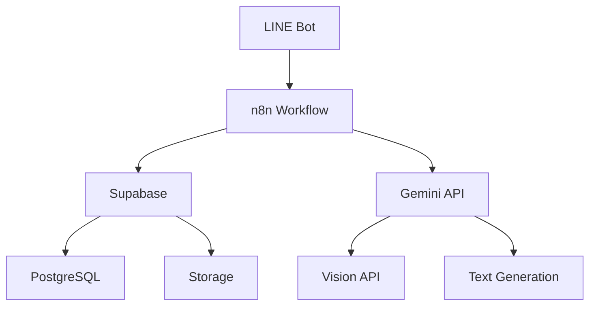
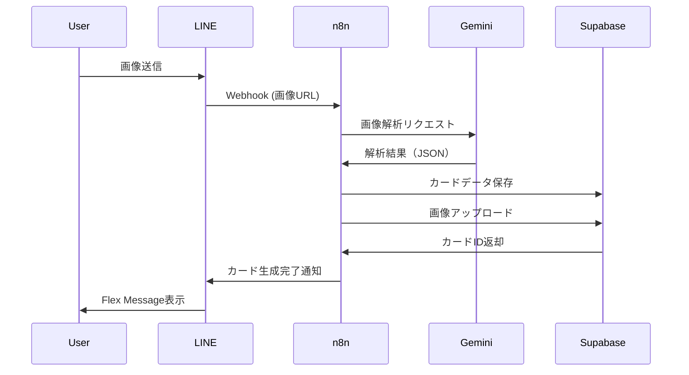

# Real Quest - プロトタイプ計画

## 1. プロトタイプの目的

### 1.1 検証すべき仮説

1. **技術的検証**
   - Gemini APIでの画像解析精度
   - カード生成アルゴリズムの妥当性
   - レスポンス時間（ユーザー体験）

2. **ユーザー検証**
   - カード生成の楽しさ
   - クエストシステムの魅力
   - 継続利用の意欲

3. **ビジネス検証**
   - 地域連携の実現可能性
   - 店舗側の反応と協力意欲
   - 収益化の見込み

### 1.2 成功基準

| 指標 | 目標値 |
|------|--------|
| テストユーザー数 | 30人以上 |
| 7日継続率 | 40%以上 |
| 1人あたりカード生成数 | 週5枚以上 |
| ユーザー満足度（5段階） | 4.0以上 |
| 協力店舗獲得 | 3店舗以上 |

## 2. プロトタイプの仕様

### 2.1 実装範囲（MVP）

#### ✅ 実装する機能
- **カード生成**
  - 画像アップロード（LINE経由）
  - AI解析とカード化
  - カード表示

- **クエストシステム**
  - デイリークエスト（3種類固定）
  - クエスト達成判定
  - 報酬付与

- **コレクション管理**
  - カード一覧表示
  - カテゴリ別フィルタ
  - 図鑑（達成率表示）

- **基本的な通知**
  - クエスト更新通知
  - カード生成完了通知

#### ❌ 実装しない機能（本開発へ先送り）
- バトルシステム
- カード交換
- パーティ機能
- 地図表示
- ガチャシステム
- プレミアム課金

### 2.2 技術スタック



#### 採用技術

| レイヤー | 技術 | 理由 |
|----------|------|------|
| **フロントエンド** | LINE Bot | ・開発不要<br/>・ユーザーの導入障壁が低い<br/>・プッシュ通知が簡単 |
| **バックエンド（オーケストレーション）** | n8n | ・ノーコード/ローコード<br/>・迅速な開発<br/>・視覚的なワークフロー |
| **データベース** | Supabase（PostgreSQL） | ・無料枠が大きい<br/>・本開発でも継続利用<br/>・RLS対応 |
| **ストレージ** | Supabase Storage | ・画像保存<br/>・DB統合 |
| **AI** | Gemini 2.0 Flash | ・高精度な画像解析<br/>・テキスト生成<br/>・コストパフォーマンス良 |

## 3. システム設計

### 3.1 全体アーキテクチャ



### 3.2 n8nワークフロー設計

#### 3.2.1 カード生成ワークフロー

**トリガー**: LINE Webhook（画像メッセージ）

```
[LINE Webhook]
    ↓
[画像ダウンロード]
    ↓
[Base64エンコード]
    ↓
[Gemini API呼び出し]
    ↓
[レスポンス解析]
    ↓
[カードパラメータ生成]
    ↓
┌─────────────┐
│ 並列処理    │
├─────────────┤
│ ① Supabase  │ カードデータ保存
│ ② Supabase  │ 画像アップロード
└─────────────┘
    ↓
[カードID取得]
    ↓
[Flex Message生成]
    ↓
[LINE Reply API]
    ↓
[ユーザーに送信]
```

**ノード構成**:
1. **Webhook** - LINE Bot からのイベント受信
2. **HTTP Request** - LINE API から画像取得
3. **Code (JavaScript)** - Base64 エンコード
4. **HTTP Request** - Gemini API 呼び出し
5. **Code (JavaScript)** - JSON パース、カードパラメータ生成
6. **Supabase** - カードデータ INSERT
7. **Supabase** - 画像 Storage アップロード
8. **Code (JavaScript)** - Flex Message 作成
9. **HTTP Request** - LINE Messaging API (Reply)

#### 3.2.2 デイリークエスト配信ワークフロー

**トリガー**: Schedule（毎朝6:00）

```
[Schedule Trigger (6:00 AM)]
    ↓
[Supabaseからユーザー一覧取得]
    ↓
[ループ: 各ユーザー]
    ↓
[ユーザーの行動履歴取得]
    ↓
[Gemini APIでクエスト生成]
    ↓
[クエストをDBに保存]
    ↓
[LINE Push Message送信]
```

#### 3.2.3 クエスト達成判定ワークフロー

**トリガー**: カード生成完了時

```
[カード生成完了]
    ↓
[今日のクエスト取得]
    ↓
[達成条件チェック]
    ↓
[条件満たす?]
    ├─ YES → [報酬付与]
    │          ↓
    │        [達成通知送信]
    └─ NO → [終了]
```

### 3.3 データベーススキーマ（簡略版）

#### users テーブル
```sql
CREATE TABLE users (
    id UUID PRIMARY KEY DEFAULT uuid_generate_v4(),
    line_user_id TEXT UNIQUE NOT NULL,
    display_name TEXT NOT NULL,
    level INTEGER DEFAULT 1,
    experience INTEGER DEFAULT 0,
    coins INTEGER DEFAULT 0,
    created_at TIMESTAMPTZ DEFAULT NOW()
);
```

#### cards テーブル
```sql
CREATE TABLE cards (
    id UUID PRIMARY KEY DEFAULT uuid_generate_v4(),
    user_id UUID REFERENCES users(id),
    name TEXT NOT NULL,
    category TEXT NOT NULL,
    rarity TEXT NOT NULL,
    attributes JSONB NOT NULL,
    description TEXT,
    image_url TEXT NOT NULL,
    created_at TIMESTAMPTZ DEFAULT NOW()
);
```

#### quests テーブル
```sql
CREATE TABLE quests (
    id UUID PRIMARY KEY DEFAULT uuid_generate_v4(),
    user_id UUID REFERENCES users(id),
    quest_type TEXT NOT NULL,
    title TEXT NOT NULL,
    description TEXT,
    requirements JSONB NOT NULL,
    rewards JSONB NOT NULL,
    is_completed BOOLEAN DEFAULT FALSE,
    completed_at TIMESTAMPTZ,
    expires_at TIMESTAMPTZ,
    created_at TIMESTAMPTZ DEFAULT NOW()
);
```

## 4. LINE Bot UI設計

### 4.1 リッチメニュー

```
┌─────────┬─────────┬─────────┐
│  📸     │  🎯     │  📚     │
│ カード  │ クエスト │ 図鑑    │
│ 作成    │         │         │
├─────────┼─────────┼─────────┤
│  👤     │  ℹ️      │  🎁     │
│マイ     │ ヘルプ  │ 報酬    │
│ページ   │         │         │
└─────────┴─────────┴─────────┘
```

### 4.2 Flex Messageデザイン

#### 4.2.1 カード表示

```json
{
  "type": "bubble",
  "hero": {
    "type": "image",
    "url": "https://storage.supabase.co/...",
    "size": "full",
    "aspectRatio": "3:4",
    "aspectMode": "cover"
  },
  "body": {
    "type": "box",
    "layout": "vertical",
    "contents": [
      {
        "type": "text",
        "text": "🌸 桜の木",
        "weight": "bold",
        "size": "xl"
      },
      {
        "type": "box",
        "layout": "baseline",
        "contents": [
          {
            "type": "text",
            "text": "レア度: ",
            "color": "#aaaaaa",
            "size": "sm"
          },
          {
            "type": "text",
            "text": "★★★★☆ Epic",
            "color": "#ff6b6b",
            "size": "sm",
            "weight": "bold"
          }
        ]
      },
      {
        "type": "box",
        "layout": "vertical",
        "margin": "lg",
        "spacing": "sm",
        "contents": [
          {
            "type": "box",
            "layout": "baseline",
            "contents": [
              {
                "type": "text",
                "text": "⚔️ 攻撃",
                "flex": 1,
                "size": "sm"
              },
              {
                "type": "text",
                "text": "45",
                "flex": 1,
                "size": "sm",
                "align": "end"
              }
            ]
          },
          {
            "type": "box",
            "layout": "baseline",
            "contents": [
              {
                "type": "text",
                "text": "🛡️ 防御",
                "flex": 1,
                "size": "sm"
              },
              {
                "type": "text",
                "text": "60",
                "flex": 1,
                "size": "sm",
                "align": "end"
              }
            ]
          }
        ]
      }
    ]
  }
}
```

#### 4.2.2 クエスト表示

```json
{
  "type": "bubble",
  "body": {
    "type": "box",
    "layout": "vertical",
    "contents": [
      {
        "type": "text",
        "text": "📅 今日のクエスト",
        "weight": "bold",
        "size": "lg"
      },
      {
        "type": "separator",
        "margin": "md"
      },
      {
        "type": "box",
        "layout": "vertical",
        "margin": "lg",
        "contents": [
          {
            "type": "text",
            "text": "🌳 自然を探せ",
            "weight": "bold"
          },
          {
            "type": "text",
            "text": "植物のカードを3枚作成しよう",
            "size": "sm",
            "color": "#aaaaaa",
            "wrap": true
          },
          {
            "type": "box",
            "layout": "baseline",
            "margin": "md",
            "contents": [
              {
                "type": "text",
                "text": "進捗:",
                "size": "sm",
                "flex": 1
              },
              {
                "type": "text",
                "text": "1 / 3",
                "size": "sm",
                "flex": 1,
                "align": "end",
                "color": "#4a90e2"
              }
            ]
          }
        ]
      }
    ]
  },
  "footer": {
    "type": "box",
    "layout": "vertical",
    "contents": [
      {
        "type": "button",
        "action": {
          "type": "camera",
          "label": "📸 カードを作る"
        },
        "style": "primary"
      }
    ]
  }
}
```

## 5. Gemini API統合

### 5.1 プロンプト設計

#### カード生成プロンプト

```javascript
const prompt = `
あなたはゲームカード生成AIです。画像を分析し、以下のJSON形式で情報を返してください。

## 出力形式（必ずこの形式で）
{
  "name": "物体の名前（20文字以内、日本語）",
  "category": "nature|artifact|location|creature|other",
  "rarity": "common|uncommon|rare|epic|legendary",
  "attributes": {
    "attack": 数値(0-100),
    "defense": 数値(0-100),
    "speed": 数値(0-100),
    "utility": 数値(0-100)
  },
  "description": "物体の魅力的な説明（50文字以内）",
  "tags": ["タグ1", "タグ2", "タグ3"]
}

## 判定基準
### カテゴリ
- nature: 植物、自然現象、景色
- artifact: 人工物、建物、道具
- location: 場所、施設、ランドマーク
- creature: 動物、昆虫、生き物
- other: その他

### レア度
- common: よくあるもの（50%）
- uncommon: やや珍しい（30%）
- rare: 珍しい（15%）
- epic: とても珍しい（4%）
- legendary: 超レア（1%）

### パラメータ
- attack: 攻撃的な印象、鋭さ（例: 包丁 90, 花 10）
- defense: 堅牢性、守りの印象（例: 城 95, 紙 5）
- speed: 速さの印象（例: 新幹線 100, 亀 5）
- utility: 実用性、便利さ（例: スマホ 95, 石 10）

## 注意事項
- 子供が見ても安全な内容にすること
- ポジティブな表現を心がけること
- JSON形式を厳密に守ること
`;
```

#### クエスト生成プロンプト

```javascript
const questPrompt = `
ユーザーの情報をもとに、楽しいデイリークエストを3つ生成してください。

## ユーザー情報
- レベル: ${level}
- 最近のカード: ${recentCards.map(c => c.name).join(', ')}
- 所在地: ${location || '不明'}

## 出力形式
[
  {
    "title": "クエストタイトル（20文字以内）",
    "description": "クエストの説明（50文字以内）",
    "requirements": {
      "type": "capture|count",
      "category": "nature|artifact|location|creature|any",
      "count": 数値(1-5)
    },
    "rewards": {
      "experience": 数値(50-200),
      "coins": 数値(10-100)
    }
  }
]

## クエスト作成ルール
- 達成可能な内容にする
- バラエティに富んだ内容にする
- ユーザーの履歴を考慮してパーソナライズする
- 季節や時期を考慮する（例: 春なら桜、冬なら雪）
`;
```

### 5.2 n8nでのGemini API呼び出し

```javascript
// n8n Code ノード
const imageBase64 = $node["画像ダウンロード"].json.imageData;

const response = await $http.request({
  method: 'POST',
  url: 'https://generativelanguage.googleapis.com/v1/models/gemini-2.0-flash:generateContent',
  headers: {
    'Content-Type': 'application/json',
    'x-goog-api-key': '{{$credentials.geminiApiKey}}'
  },
  body: {
    contents: [{
      parts: [
        { text: prompt },
        {
          inline_data: {
            mime_type: "image/jpeg",
            data: imageBase64
          }
        }
      ]
    }],
    generationConfig: {
      temperature: 0.7,
      topK: 40,
      topP: 0.95,
      maxOutputTokens: 1024,
    }
  }
});

// レスポンスからJSONを抽出
const generatedText = response.candidates[0].content.parts[0].text;
const cardData = JSON.parse(generatedText);

return { json: cardData };
```

## 6. 開発スケジュール

### 6.1 タイムライン（8週間）

| 週 | タスク | 成果物 |
|----|--------|--------|
| **Week 1** | 環境構築、要件整理 | ・Supabase プロジェクト作成<br/>・n8n セットアップ<br/>・LINE Bot 作成 |
| **Week 2** | データベース設計、実装 | ・テーブル作成<br/>・RLS 設定<br/>・テストデータ投入 |
| **Week 3** | カード生成ワークフロー | ・画像アップロード<br/>・Gemini API統合<br/>・カード表示 |
| **Week 4** | クエストシステム | ・クエスト生成<br/>・達成判定<br/>・報酬付与 |
| **Week 5** | 図鑑・コレクション機能 | ・カード一覧<br/>・フィルタ機能<br/>・達成率表示 |
| **Week 6** | UI/UX改善 | ・Flex Message デザイン<br/>・リッチメニュー<br/>・エラーハンドリング |
| **Week 7** | テストと修正 | ・内部テスト<br/>・バグ修正<br/>・パフォーマンス改善 |
| **Week 8** | ユーザーテスト | ・30人でのテスト<br/>・フィードバック収集<br/>・レポート作成 |

### 6.2 Week 1: 環境構築

#### Day 1-2: Supabase
- [ ] プロジェクト作成
- [ ] データベース設計
- [ ] Storage バケット作成
- [ ] API キー取得

#### Day 3-4: n8n
- [ ] n8n インスタンス起動（Docker or n8n Cloud）
- [ ] Supabase 接続設定
- [ ] Gemini API 接続設定

#### Day 5-7: LINE Bot
- [ ] LINE Developers アカウント作成
- [ ] Messaging API チャネル作成
- [ ] Webhook URL 設定（n8n）
- [ ] リッチメニュー設定

### 6.3 Week 3: カード生成（詳細）

#### Step 1: 画像受信
```
n8n Webhook ノード設定
- Method: POST
- Path: /webhook/line
- Authentication: なし
```

#### Step 2: 画像ダウンロード
```javascript
// HTTP Request ノード
const messageId = $json.events[0].message.id;
const url = `https://api-data.line.me/v2/bot/message/${messageId}/content`;

return {
  method: 'GET',
  url: url,
  headers: {
    'Authorization': 'Bearer {{LINE_CHANNEL_ACCESS_TOKEN}}'
  },
  encoding: 'arraybuffer'
};
```

#### Step 3: Gemini API 呼び出し
（5.2 参照）

#### Step 4: データ保存
```javascript
// Supabase ノード
{
  operation: 'insert',
  table: 'cards',
  data: {
    user_id: userId,
    name: cardData.name,
    category: cardData.category,
    rarity: cardData.rarity,
    attributes: cardData.attributes,
    description: cardData.description,
    image_url: uploadedImageUrl,
    tags: cardData.tags
  }
}
```

#### Step 5: 結果送信
（4.2.1 参照）

## 7. テスト計画

### 7.1 テストフェーズ

#### Phase 1: 内部テスト（Week 7）
- **対象**: 開発チーム（3～5人）
- **目的**: 基本機能の動作確認、重大なバグ発見
- **期間**: 5日間

**テスト項目**:
- [ ] カード生成（様々な画像で）
- [ ] クエスト配信と達成判定
- [ ] 図鑑表示
- [ ] エラーケース（通信エラー、不正画像等）

#### Phase 2: クローズドβ（Week 8）
- **対象**: 外部テスター30人（家族層中心）
- **目的**: ユーザー体験の検証、継続率測定
- **期間**: 7日間

**収集データ**:
- カード生成数
- クエスト達成率
- 継続率（1日目、3日目、7日目）
- ユーザーフィードバック（アンケート）

### 7.2 アンケート項目

```
1. カード生成は楽しかったですか？（1-5）
2. クエストは達成したくなりましたか？（1-5）
3. 明日も使いたいと思いますか？（1-5）
4. 家族や友達に勧めたいですか？（NPS）
5. 最も気に入った点は？（自由記述）
6. 改善してほしい点は？（自由記述）
7. 月額980円で課金したいですか？（はい/いいえ）
```

### 7.3 成功基準（再掲）

| 指標 | 目標 | 測定方法 |
|------|------|----------|
| 7日継続率 | 40%以上 | Supabase ログ分析 |
| 1人あたりカード生成数 | 週5枚以上 | DB集計 |
| ユーザー満足度 | 4.0/5以上 | アンケート |
| NPS | 50以上 | アンケート |

## 8. コスト見積もり

### 8.1 開発コスト

| 項目 | 時間 | 単価 | 合計 |
|------|------|------|------|
| 要件定義・設計 | 20h | 5,000円/h | 10万円 |
| 開発（n8n） | 60h | 5,000円/h | 30万円 |
| デザイン（Flex Message） | 10h | 5,000円/h | 5万円 |
| テスト・修正 | 20h | 5,000円/h | 10万円 |
| **合計** | **110h** | - | **55万円** |

※ 1人で開発する場合は機会コスト

### 8.2 ランニングコスト（月額）

| サービス | プラン | 費用 |
|----------|--------|------|
| Supabase | Free Tier | 0円 |
| n8n Cloud | Starter | $20（約3,000円） |
| Gemini API | Pay-as-you-go | 約5,000円* |
| LINE Messaging API | Free | 0円** |
| **合計** | - | **約8,000円/月** |

*30人 × 5枚/週 × 4週 = 600回/月 @ 約8円/回  
**月1,000通まで無料、超過分は不要

### 8.3 ユーザーテスト費用

| 項目 | 費用 |
|------|------|
| テスターへの謝礼（30人 × 500円分のギフト） | 15,000円 |
| 広告費（テスター募集） | 10,000円 |
| **合計** | **25,000円** |

## 9. リスクと対策

| リスク | 影響 | 対策 |
|--------|------|------|
| Gemini API のレスポンス遅延 | 中 | ・タイムアウト設定<br/>・「生成中...」メッセージ |
| 不適切な画像の投稿 | 高 | ・Gemini Safety Settings<br/>・人手による確認 |
| n8n の安定性 | 中 | ・エラーハンドリング強化<br/>・セルフホストも検討 |
| ユーザーの継続率低下 | 高 | ・クエストの魅力向上<br/>・報酬バランス調整 |
| 予算超過（Gemini API） | 中 | ・月間上限設定<br/>・使用状況モニタリング |

## 10. 成果物とネクストステップ

### 10.1 成果物

1. **動作するプロトタイプ**
   - LINE Bot でのカード生成機能
   - クエストシステム
   - 図鑑機能

2. **検証レポート**
   - ユーザーテスト結果
   - 技術的な学び
   - ビジネス検証結果

3. **改善提案書**
   - 本開発に向けた機能改善案
   - UI/UX の改善点
   - ビジネスモデルの調整

### 10.2 ネクストステップ

**プロトタイプ成功時**:
1. 投資家へのピッチ（シード資金調達）
2. Flutter アプリ開発開始（MVP）
3. 地域連携のパイロット実施

**学びを活かした改善**:
- ユーザーフィードバックを反映
- 技術的課題の解決策を設計
- ビジネスモデルの微調整

---

**バージョン**: 1.0  
**最終更新**: 2025-11-29  
**作成者**: Antigravity AI
