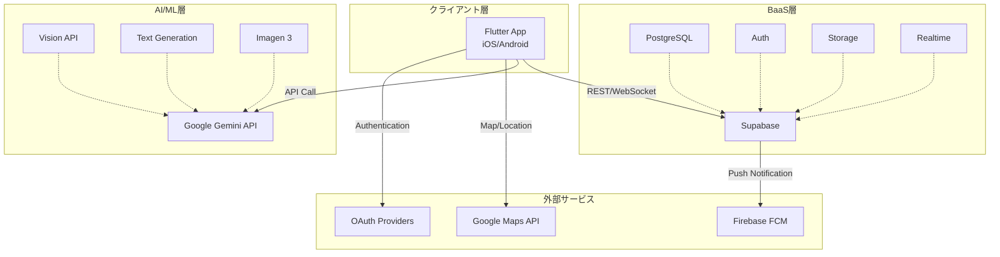
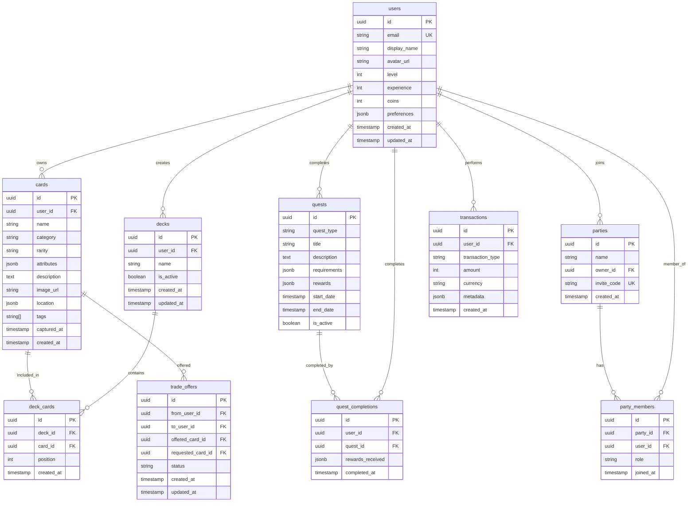
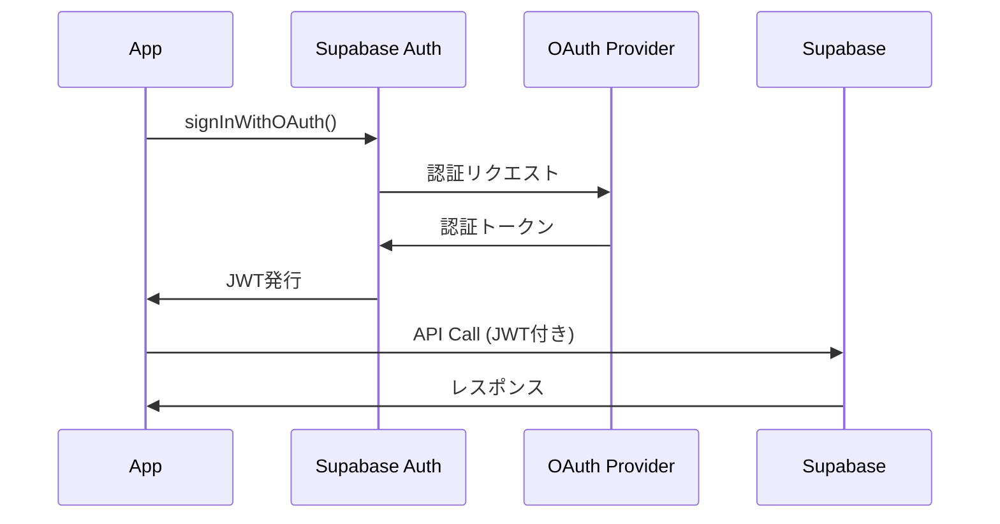

# Real Quest - 技術設計書

## 1. システムアーキテクチャ

### 1.1 全体構成図



### 1.2 技術スタック詳細

#### 1.2.1 フロントエンド（Flutter）

```yaml
dependencies:
  # コア
  flutter_riverpod: ^2.4.0  # 状態管理
  go_router: ^12.0.0  # ルーティング
  
  # Supabase
  supabase_flutter: ^2.0.0
  
  # UI
  flutter_svg: ^2.0.9
  cached_network_image: ^3.3.0
  shimmer: ^3.0.0
  
  # カメラ・画像
  camera: ^0.10.5
  image_picker: ^1.0.4
  image: ^4.1.3
  
  # 位置情報
  google_maps_flutter: ^2.5.0
  geolocator: ^10.1.0
  
  # 通知
  firebase_messaging: ^14.7.0
  
  # ユーティリティ
  uuid: ^4.1.0
  intl: ^0.18.1
  shared_preferences: ^2.2.2
```

#### 1.2.2 バックエンド（Supabase）

**PostgreSQL バージョン**: 15.x  
**Supabase CLI**: 最新版

#### 1.2.3 AI/ML

- **Gemini 2.0 Flash**: 画像解析、テキスト生成
- **Imagen 3**: カードイラスト生成（オプション）

## 2. データベース設計

### 2.1 ER図



### 2.2 テーブル定義（SQL）

#### 2.2.1 users テーブル

```sql
CREATE TABLE users (
    id UUID PRIMARY KEY DEFAULT uuid_generate_v4(),
    email TEXT UNIQUE NOT NULL,
    display_name TEXT NOT NULL,
    avatar_url TEXT,
    level INTEGER DEFAULT 1,
    experience INTEGER DEFAULT 0,
    coins INTEGER DEFAULT 0,
    preferences JSONB DEFAULT '{}'::jsonb,
    created_at TIMESTAMPTZ DEFAULT NOW(),
    updated_at TIMESTAMPTZ DEFAULT NOW()
);

-- インデックス
CREATE INDEX idx_users_email ON users(email);
CREATE INDEX idx_users_level ON users(level DESC);

-- RLS (Row Level Security)
ALTER TABLE users ENABLE ROW LEVEL SECURITY;

CREATE POLICY "Users can view their own data"
    ON users FOR SELECT
    USING (auth.uid() = id);

CREATE POLICY "Users can update their own data"
    ON users FOR UPDATE
    USING (auth.uid() = id);
```

#### 2.2.2 cards テーブル

```sql
CREATE TABLE cards (
    id UUID PRIMARY KEY DEFAULT uuid_generate_v4(),
    user_id UUID NOT NULL REFERENCES users(id) ON DELETE CASCADE,
    name TEXT NOT NULL,
    category TEXT NOT NULL CHECK (category IN ('nature', 'artifact', 'location', 'creature', 'other')),
    rarity TEXT NOT NULL CHECK (rarity IN ('common', 'uncommon', 'rare', 'epic', 'legendary')),
    attributes JSONB NOT NULL DEFAULT '{
        "attack": 0,
        "defense": 0,
        "speed": 0,
        "utility": 0
    }'::jsonb,
    description TEXT,
    image_url TEXT NOT NULL,
    location JSONB,
    tags TEXT[] DEFAULT ARRAY[]::TEXT[],
    captured_at TIMESTAMPTZ DEFAULT NOW(),
    created_at TIMESTAMPTZ DEFAULT NOW()
);

-- インデックス
CREATE INDEX idx_cards_user_id ON cards(user_id);
CREATE INDEX idx_cards_category ON cards(category);
CREATE INDEX idx_cards_rarity ON cards(rarity);
CREATE INDEX idx_cards_captured_at ON cards(captured_at DESC);
CREATE INDEX idx_cards_tags ON cards USING GIN(tags);

-- RLS
ALTER TABLE cards ENABLE ROW LEVEL SECURITY;

CREATE POLICY "Users can view their own cards"
    ON cards FOR SELECT
    USING (auth.uid() = user_id);

CREATE POLICY "Users can insert their own cards"
    ON cards FOR INSERT
    WITH CHECK (auth.uid() = user_id);

CREATE POLICY "Users can delete their own cards"
    ON cards FOR DELETE
    USING (auth.uid() = user_id);
```

#### 2.2.3 decks テーブル

```sql
CREATE TABLE decks (
    id UUID PRIMARY KEY DEFAULT uuid_generate_v4(),
    user_id UUID NOT NULL REFERENCES users(id) ON DELETE CASCADE,
    name TEXT NOT NULL,
    is_active BOOLEAN DEFAULT FALSE,
    created_at TIMESTAMPTZ DEFAULT NOW(),
    updated_at TIMESTAMPTZ DEFAULT NOW()
);

CREATE INDEX idx_decks_user_id ON decks(user_id);
CREATE INDEX idx_decks_is_active ON decks(user_id, is_active);

ALTER TABLE decks ENABLE ROW LEVEL SECURITY;

CREATE POLICY "Users can manage their own decks"
    ON decks FOR ALL
    USING (auth.uid() = user_id);
```

#### 2.2.4 deck_cards テーブル

```sql
CREATE TABLE deck_cards (
    id UUID PRIMARY KEY DEFAULT uuid_generate_v4(),
    deck_id UUID NOT NULL REFERENCES decks(id) ON DELETE CASCADE,
    card_id UUID NOT NULL REFERENCES cards(id) ON DELETE CASCADE,
    position INTEGER NOT NULL CHECK (position BETWEEN 1 AND 5),
    created_at TIMESTAMPTZ DEFAULT NOW(),
    UNIQUE(deck_id, position)
);

CREATE INDEX idx_deck_cards_deck_id ON deck_cards(deck_id);
CREATE INDEX idx_deck_cards_card_id ON deck_cards(card_id);

ALTER TABLE deck_cards ENABLE ROW LEVEL SECURITY;

CREATE POLICY "Users can manage cards in their own decks"
    ON deck_cards FOR ALL
    USING (
        EXISTS (
            SELECT 1 FROM decks
            WHERE decks.id = deck_cards.deck_id
            AND decks.user_id = auth.uid()
        )
    );
```

#### 2.2.5 quests テーブル

```sql
CREATE TABLE quests (
    id UUID PRIMARY KEY DEFAULT uuid_generate_v4(),
    quest_type TEXT NOT NULL CHECK (quest_type IN ('daily', 'weekly', 'story', 'regional')),
    title TEXT NOT NULL,
    description TEXT,
    requirements JSONB NOT NULL,
    rewards JSONB NOT NULL,
    start_date TIMESTAMPTZ DEFAULT NOW(),
    end_date TIMESTAMPTZ,
    is_active BOOLEAN DEFAULT TRUE,
    created_at TIMESTAMPTZ DEFAULT NOW()
);

CREATE INDEX idx_quests_type_active ON quests(quest_type, is_active);
CREATE INDEX idx_quests_dates ON quests(start_date, end_date);

ALTER TABLE quests ENABLE ROW LEVEL SECURITY;

CREATE POLICY "Anyone can view active quests"
    ON quests FOR SELECT
    USING (is_active = TRUE);
```

#### 2.2.6 quest_completions テーブル

```sql
CREATE TABLE quest_completions (
    id UUID PRIMARY KEY DEFAULT uuid_generate_v4(),
    user_id UUID NOT NULL REFERENCES users(id) ON DELETE CASCADE,
    quest_id UUID NOT NULL REFERENCES quests(id) ON DELETE CASCADE,
    rewards_received JSONB,
    completed_at TIMESTAMPTZ DEFAULT NOW(),
    UNIQUE(user_id, quest_id)
);

CREATE INDEX idx_quest_completions_user_id ON quest_completions(user_id);
CREATE INDEX idx_quest_completions_quest_id ON quest_completions(quest_id);

ALTER TABLE quest_completions ENABLE ROW LEVEL SECURITY;

CREATE POLICY "Users can view their own quest completions"
    ON quest_completions FOR SELECT
    USING (auth.uid() = user_id);

CREATE POLICY "Users can insert their own quest completions"
    ON quest_completions FOR INSERT
    WITH CHECK (auth.uid() = user_id);
```

#### 2.2.7 parties テーブル

```sql
CREATE TABLE parties (
    id UUID PRIMARY KEY DEFAULT uuid_generate_v4(),
    name TEXT NOT NULL,
    owner_id UUID NOT NULL REFERENCES users(id) ON DELETE CASCADE,
    invite_code TEXT UNIQUE NOT NULL DEFAULT substring(md5(random()::text) from 1 for 8),
    created_at TIMESTAMPTZ DEFAULT NOW()
);

CREATE INDEX idx_parties_owner_id ON parties(owner_id);
CREATE INDEX idx_parties_invite_code ON parties(invite_code);

ALTER TABLE parties ENABLE ROW LEVEL SECURITY;

CREATE POLICY "Party members can view their party"
    ON parties FOR SELECT
    USING (
        EXISTS (
            SELECT 1 FROM party_members
            WHERE party_members.party_id = parties.id
            AND party_members.user_id = auth.uid()
        )
    );
```

#### 2.2.8 party_members テーブル

```sql
CREATE TABLE party_members (
    id UUID PRIMARY KEY DEFAULT uuid_generate_v4(),
    party_id UUID NOT NULL REFERENCES parties(id) ON DELETE CASCADE,
    user_id UUID NOT NULL REFERENCES users(id) ON DELETE CASCADE,
    role TEXT NOT NULL CHECK (role IN ('owner', 'admin', 'member')),
    joined_at TIMESTAMPTZ DEFAULT NOW(),
    UNIQUE(party_id, user_id)
);

CREATE INDEX idx_party_members_party_id ON party_members(party_id);
CREATE INDEX idx_party_members_user_id ON party_members(user_id);

ALTER TABLE party_members ENABLE ROW LEVEL SECURITY;

CREATE POLICY "Party members can view other members"
    ON party_members FOR SELECT
    USING (
        EXISTS (
            SELECT 1 FROM party_members pm
            WHERE pm.party_id = party_members.party_id
            AND pm.user_id = auth.uid()
        )
    );
```

#### 2.2.9 transactions テーブル

```sql
CREATE TABLE transactions (
    id UUID PRIMARY KEY DEFAULT uuid_generate_v4(),
    user_id UUID NOT NULL REFERENCES users(id) ON DELETE CASCADE,
    transaction_type TEXT NOT NULL CHECK (transaction_type IN ('purchase', 'quest_reward', 'daily_bonus', 'trade')),
    amount INTEGER NOT NULL,
    currency TEXT NOT NULL CHECK (currency IN ('coins', 'premium')),
    metadata JSONB DEFAULT '{}'::jsonb,
    created_at TIMESTAMPTZ DEFAULT NOW()
);

CREATE INDEX idx_transactions_user_id ON transactions(user_id);
CREATE INDEX idx_transactions_type ON transactions(transaction_type);
CREATE INDEX idx_transactions_created_at ON transactions(created_at DESC);

ALTER TABLE transactions ENABLE ROW LEVEL SECURITY;

CREATE POLICY "Users can view their own transactions"
    ON transactions FOR SELECT
    USING (auth.uid() = user_id);
```

#### 2.2.10 trade_offers テーブル

```sql
CREATE TABLE trade_offers (
    id UUID PRIMARY KEY DEFAULT uuid_generate_v4(),
    from_user_id UUID NOT NULL REFERENCES users(id) ON DELETE CASCADE,
    to_user_id UUID NOT NULL REFERENCES users(id) ON DELETE CASCADE,
    offered_card_id UUID NOT NULL REFERENCES cards(id) ON DELETE CASCADE,
    requested_card_id UUID REFERENCES cards(id) ON DELETE CASCADE,
    status TEXT NOT NULL CHECK (status IN ('pending', 'accepted', 'rejected', 'cancelled')) DEFAULT 'pending',
    created_at TIMESTAMPTZ DEFAULT NOW(),
    updated_at TIMESTAMPTZ DEFAULT NOW()
);

CREATE INDEX idx_trade_offers_from_user ON trade_offers(from_user_id);
CREATE INDEX idx_trade_offers_to_user ON trade_offers(to_user_id);
CREATE INDEX idx_trade_offers_status ON trade_offers(status);

ALTER TABLE trade_offers ENABLE ROW LEVEL SECURITY;

CREATE POLICY "Users can view trades involving them"
    ON trade_offers FOR SELECT
    USING (auth.uid() IN (from_user_id, to_user_id));

CREATE POLICY "Users can create trade offers"
    ON trade_offers FOR INSERT
    WITH CHECK (auth.uid() = from_user_id);

CREATE POLICY "Users can update received trade offers"
    ON trade_offers FOR UPDATE
    USING (auth.uid() = to_user_id);
```

## 3. API設計

### 3.1 Supabase Edge Functions

#### 3.1.1 カード生成API

**エンドポイント**: `POST /functions/v1/generate-card`

**リクエスト**:
```json
{
  "imageBase64": "data:image/jpeg;base64,...",
  "location": {
    "latitude": 35.6812,
    "longitude": 139.7671,
    "placeName": "東京タワー"
  }
}
```

**レスポンス**:
```json
{
  "success": true,
  "card": {
    "id": "uuid",
    "name": "東京タワー",
    "category": "location",
    "rarity": "epic",
    "attributes": {
      "attack": 75,
      "defense": 85,
      "speed": 40,
      "utility": 90
    },
    "description": "東京のシンボルとして知られる...",
    "imageUrl": "https://storage.supabase.co/...",
    "tags": ["ランドマーク", "観光", "東京"]
  }
}
```

**処理フロー**:
```typescript
// Supabase Edge Function
import { serve } from 'https://deno.land/std@0.168.0/http/server.ts'
import { createClient } from 'https://esm.sh/@supabase/supabase-js@2'

serve(async (req) => {
  const { imageBase64, location } = await req.json()
  
  // 1. Gemini APIで画像解析
  const analysis = await analyzeImage(imageBase64)
  
  // 2. カードパラメータ生成
  const cardData = generateCardParameters(analysis, location)
  
  // 3. 画像をStorageに保存
  const imageUrl = await uploadImage(imageBase64)
  
  // 4. DBに保存
  const supabase = createClient(...)
  const { data: card } = await supabase
    .from('cards')
    .insert({
      ...cardData,
      image_url: imageUrl,
      user_id: req.headers.get('user-id')
    })
    .select()
    .single()
  
  return new Response(
    JSON.stringify({ success: true, card }),
    { headers: { 'Content-Type': 'application/json' } }
  )
})
```

#### 3.1.2 クエスト生成API

**エンドポイント**: `POST /functions/v1/generate-daily-quests`

**処理**:
- ユーザーの行動履歴を分析
- Gemini APIでパーソナライズされたクエストを生成
- DBに保存

#### 3.1.3 バトル実行API

**エンドポイント**: `POST /functions/v1/execute-battle`

**リクエスト**:
```json
{
  "deckId": "uuid",
  "enemyType": "wild|boss|pvp"
}
```

**レスポンス**:
```json
{
  "success": true,
  "result": "victory|defeat",
  "battleLog": [...],
  "rewards": {
    "experience": 100,
    "coins": 50
  }
}
```

### 3.2 Supabase Realtime

#### 3.2.1 パーティチャット

```dart
final channel = supabase.channel('party:${partyId}');

channel
  .on(RealtimeListenTypes.postgresChanges,
    ChannelFilter(
      event: 'INSERT',
      schema: 'public',
      table: 'party_messages',
      filter: 'party_id=eq.$partyId',
    ),
    (payload, [ref]) {
      // メッセージ受信処理
    }
  )
  .subscribe();
```

#### 3.2.2 トレード通知

```dart
supabase
  .from('trade_offers')
  .stream(primaryKey: ['id'])
  .eq('to_user_id', userId)
  .listen((data) {
    // トレードオファー受信
  });
```

## 4. Gemini API統合

### 4.1 画像解析プロンプト

```typescript
const prompt = `
あなたは物体を分析し、ゲームカードのパラメータを生成するAIです。

## 画像情報
この画像を分析し、以下の情報をJSON形式で返してください。

## 出力形式
{
  "name": "物体の名前（日本語、20文字以内）",
  "category": "nature|artifact|location|creature|other",
  "rarity": "common|uncommon|rare|epic|legendary",
  "attributes": {
    "attack": 0-100,
    "defense": 0-100,
    "speed": 0-100,
    "utility": 0-100
  },
  "description": "物体の説明（100文字以内）",
  "tags": ["タグ1", "タグ2", "タグ3"]
}

## 判定基準
- rarity: ユニーク性、希少性、歴史的価値などを考慮
- attack: 攻撃的な印象、鋭さ、強さ
- defense: 堅牢性、守りの印象
- speed: 動きの速さ、機動性の印象
- utility: 実用性、便利さ
`
```

### 4.2 クエスト生成プロンプト

```typescript
const questPrompt = `
ユーザーの行動履歴に基づいて、楽しいデイリークエストを3つ生成してください。

## ユーザー情報
- レベル: ${userLevel}
- 最近の行動: ${recentActivities}
- 所在地: ${location}

## 出力形式
[
  {
    "title": "クエストタイトル",
    "description": "クエストの説明",
    "requirements": {
      "type": "capture|visit|battle",
      "target": "対象",
      "count": 数量
    },
    "rewards": {
      "experience": 100,
      "coins": 50
    }
  }
]
`
```

## 5. セキュリティ設計

### 5.1 認証・認可

#### Supabase Auth フロー



### 5.2 RLS (Row Level Security)

すべてのテーブルでRLSを有効化し、ユーザーは自分のデータのみアクセス可能。

### 5.3 画像の安全性

- 顔検出とモザイク処理
- 不適切コンテンツフィルタ（Gemini Safety Settings）
- 画像サイズ制限（最大5MB）

## 6. パフォーマンス最適化

### 6.1 キャッシュ戦略

```dart
// カード画像のキャッシュ
CachedNetworkImage(
  imageUrl: cardImageUrl,
  placeholder: (context, url) => ShimmerWidget(),
  errorWidget: (context, url, error) => Icon(Icons.error),
  cacheKey: 'card_$cardId',
  maxHeightDiskCache: 800,
  maxWidthDiskCache: 600,
)
```

### 6.2 遅延ロード

```dart
// 無限スクロール
ListView.builder(
  itemCount: cards.length + 1,
  itemBuilder: (context, index) {
    if (index == cards.length) {
      // 次ページ読み込み
      _loadMore();
      return CircularProgressIndicator();
    }
    return CardWidget(card: cards[index]);
  },
)
```

### 6.3 画像圧縮

```dart
// アップロード前に圧縮
final compressedImage = await FlutterImageCompress.compressWithFile(
  imageFile.absolute.path,
  quality: 85,
  maxWidth: 1920,
  maxHeight: 1080,
);
```

## 7. エラーハンドリング

### 7.1 エラー分類

```dart
enum AppError {
  networkError,
  authenticationError,
  permissionDenied,
  cardGenerationFailed,
  questNotFound,
  insufficientBalance,
  unknown,
}
```

### 7.2 リトライ戦略

```dart
Future<T> retryOperation<T>(
  Future<T> Function() operation, {
  int maxAttempts = 3,
  Duration delay = const Duration(seconds: 2),
}) async {
  for (int i = 0; i < maxAttempts; i++) {
    try {
      return await operation();
    } catch (e) {
      if (i == maxAttempts - 1) rethrow;
      await Future.delayed(delay);
    }
  }
  throw Exception('Should not reach here');
}
```

---

**バージョン**: 1.0  
**最終更新**: 2025-11-29  
**作成者**: Antigravity AI
